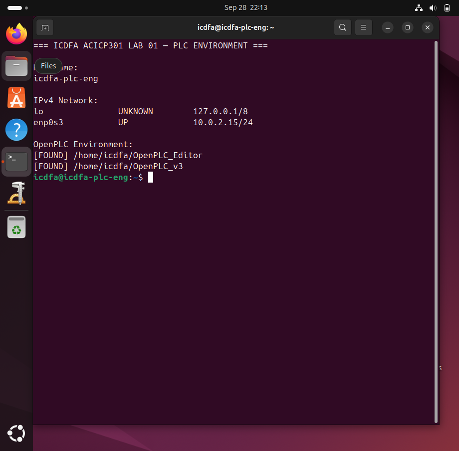
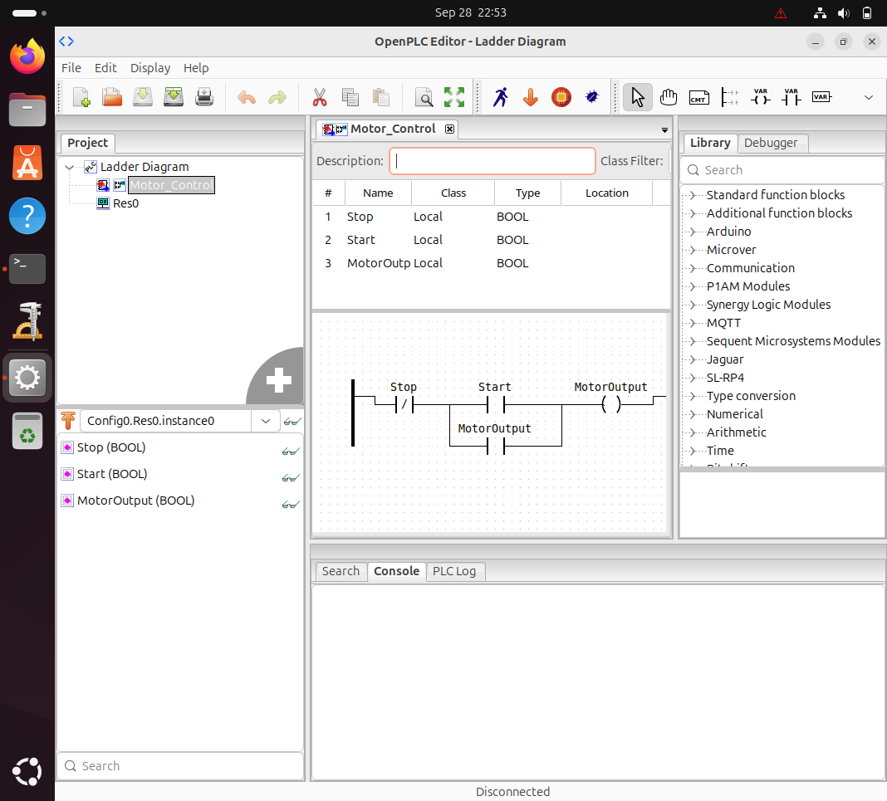

# ACICP301 — Practical Lab 01
## Introduction to Programmable Logic Controllers and OpenPLC

**Course:** ACICP301 — ICS & SCADA Systems  
**Practical:** Lab 01 — Introduction to Programmable Logic Controllers and OpenPLC  
**Environment:** ICDFA-authorized PLC Engineering virtual machine  
**Platform:** OpenPLC Editor  
**Status:** Completed

---

## 1. Objective

The purpose of this practical laboratory was to examine the basic architecture and operating principles of a Programmable Logic Controller (PLC), distinguish between discrete and analog input/output signals, access the ICDFA OpenPLC development environment, and interpret an existing Ladder Diagram motor-control program.

The practical also demonstrated how a basic motor start/stop control requirement can be implemented using normally open and normally closed contacts, an output coil, and a seal-in or latching contact.

---

## 2. Laboratory Environment

The practical was performed in the ICDFA-provided PLC Engineering virtual machine within an isolated VirtualBox laboratory environment.

The assigned VM was verified before beginning the practical. The current training image used the following environment:

- Hostname: `icdfa-plc-eng`
- Active IPv4 address: `10.0.2.15/24`
- OpenPLC Editor: installed
- OpenPLC Runtime/OpenPLC v3: installed

The supplied laboratory image used a revised network address. No attempt was made to manually replace the assigned address with the older address referenced in legacy material.

### Evidence 01 — PLC/OpenPLC Laboratory Environment

**Observation:**  
The screenshot confirms successful access to the assigned ICDFA PLC Engineering VM. It shows the active VM hostname and network configuration and verifies the presence of both the OpenPLC Editor and OpenPLC v3 environment.

---

## 3. PLC Architecture Analysis

A PLC is an industrial controller designed to monitor field inputs, execute deterministic control logic and update field outputs.

| PLC Component | Function |
|---|---|
| **Processor / CPU** | Executes the PLC control program, evaluates input conditions, performs logic operations and updates outputs during the controller scan cycle. |
| **Memory** | Stores the PLC program, configuration, variables, I/O states and other data required during controller operation. |
| **Power Supply** | Converts the incoming supply into regulated power required by the PLC processor and installed modules. |
| **Input Module** | Receives signals from field devices such as switches, sensors and transmitters and makes them available to the PLC program. |
| **Output Module** | Converts PLC program decisions into signals that operate devices such as relays, valves, indicators and motor contactors. |
| **Rack / Chassis** | Provides the physical mounting structure and backplane/interconnection used by the PLC processor and I/O modules. |
| **Programming Interface / Device** | Provides the engineering environment used to create, load, inspect and troubleshoot PLC programs. OpenPLC Editor performs this role in this laboratory. |

### Evidence 02 — PLC Architecture

The PLC architecture analysis above identifies the major controller components and explains the functional role of each component in an industrial automation system.

---

## 4. Industrial Input/Output Classification

PLC I/O can be divided into discrete/digital signals and analog signals.

Discrete signals normally represent two logical states, such as TRUE/FALSE, ON/OFF or OPEN/CLOSED. Analog signals represent continuously varying process quantities.

| I/O Classification | Industrial Example | Explanation |
|---|---|---|
| **Discrete Input** | Motor Start push button | Represents two states: pressed or not pressed. |
| **Analog Input** | Tank-level transmitter | Provides a continuously varying measurement representing liquid level. |
| **Discrete Output** | Motor contactor command | Controls a device using two states such as ON or OFF. |
| **Analog Output** | Control-valve position command | Represents a continuously varying actuator command, for example a required valve position from 0–100%. |

### Evidence 03 — I/O Classification

The table demonstrates the difference between discrete and analog I/O and provides an industrial example for each required category.

---

## 5. OpenPLC Motor-Control Ladder Logic

The supplied Ladder Diagram project was opened in OpenPLC Editor. The `Motor_Control` program contains three Boolean variables:

- `Stop`
- `Start`
- `MotorOutput`

The program implements a conventional motor start/stop latching circuit.

### Evidence 04 — Motor_Control Ladder Diagram

### Ladder Logic Interpretation

**Stop contact:**  
`Stop` is represented by a normally closed contact. During the normal condition, the logical path through the Stop contact remains available. When the Stop condition becomes TRUE, the contact opens logically and interrupts the control rung.

**Start contact:**  
`Start` is represented by a normally open contact. When Start becomes TRUE, the contact closes and provides a path for the `MotorOutput` coil to energize.

**MotorOutput latch contact:**  
A normally open `MotorOutput` contact is connected in parallel with the Start contact. Once the `MotorOutput` coil becomes energized, this feedback contact closes and provides an alternate current path around the Start contact. This creates the seal-in or latching function.

**MotorOutput coil:**  
The `MotorOutput` coil is energized when the Stop path is available and either the Start contact or the MotorOutput latch contact provides continuity.

### Sequence of Operation

1. Initially, the Stop path is available but the Start contact is open, so `MotorOutput` remains OFF.
2. Activating Start closes the Start contact.
3. The `MotorOutput` coil energizes.
4. The parallel `MotorOutput` feedback contact closes.
5. Releasing Start does not stop the motor because the feedback contact maintains the logical path.
6. Activating Stop opens the normally closed Stop contact.
7. `MotorOutput` de-energizes.
8. The MotorOutput feedback contact opens, releasing the latch and leaving the motor OFF.

---

## 6. Evidence 05 — Reflection on Network-Connected PLCs

Network-connected Programmable Logic Controllers provide significant operational benefits in industrial and critical-infrastructure environments. Connectivity allows PLCs to exchange process data with supervisory systems, Human Machine Interfaces, engineering workstations and other automation devices. This improves operational visibility, enables centralized monitoring, supports faster troubleshooting and allows process information to be collected for alarms, events and historical analysis. Remote engineering access can also simplify maintenance when it is properly controlled.

However, connecting PLCs to networks also introduces cybersecurity considerations. A compromise of network communications or an engineering interface could affect the availability or integrity of the control process. Unauthorized changes to PLC logic, manipulated process values or disruption of communications may result in incorrect equipment operation or loss of process visibility. Industrial environments therefore require appropriate network segmentation, restricted administrative access, controlled engineering workstations, monitoring and protection of industrial protocols and devices.

This laboratory demonstrates that PLCs are not simply standalone control devices. Once connected to wider industrial networks, their operational value increases, but so does the need to protect the systems, communications and engineering interfaces that influence the physical process.

---

## 7. Knowledge Check

### 1. What is the difference between an input module and an output module?

An input module receives signals from field devices such as push buttons, switches and sensors and makes those values available to the PLC control program. An output module receives commands generated by the PLC program and converts them into signals that operate field devices such as relays, valves, indicators or motor contactors.

### 2. Why is a normally closed contact commonly associated with stop or emergency-stop logic?

A normally closed logical contact provides continuity during the normal operating condition and opens when the stop condition becomes active. In the Motor_Control example, activating the Stop condition breaks the control rung, de-energizes `MotorOutput` and releases the latching circuit.

### 3. Give one example of a discrete I/O signal and one example of an analog I/O signal.

A motor Start push button is an example of a discrete input because it has two logical states. A tank-level transmitter is an example of an analog input because it represents a continuously varying physical measurement.

### 4. What operational risk can arise when industrial automation devices become network-connected?

Network connectivity creates the possibility that unauthorized access, altered control data, malicious configuration changes or communication disruption could affect an industrial process. Consequences may include incorrect equipment operation, loss of process visibility or interruption of control functions.

---

## 8. Conclusion

This practical laboratory demonstrated the fundamental architecture and operating principles of a PLC and introduced the OpenPLC engineering environment. The supplied motor-control Ladder Diagram showed how normally open and normally closed contacts, an output coil and a seal-in contact can implement a persistent start/stop control function.

The exercise also demonstrated the distinction between discrete and analog industrial I/O and highlighted that network connectivity provides significant operational benefits while introducing additional cybersecurity considerations that must be managed within industrial-control environments.

---

## Evidence Files

| Evidence | File |
|---|---|
| Evidence 01 — PLC/OpenPLC Environment | `evidence/lab01-evidence-01-plc-environment.png` |
| Evidence 02 — PLC Architecture | Documented in Section 3 |
| Evidence 03 — I/O Classification | Documented in Section 4 |
| Evidence 04 — Motor_Control Ladder Logic | `evidence/lab01-evidence-04-motor-control-ladder.png` |
| Evidence 05 — Cybersecurity Reflection | Documented in Section 6 |

---

**Laboratory scope:** All work was performed only within the authorized ICDFA training environment.
