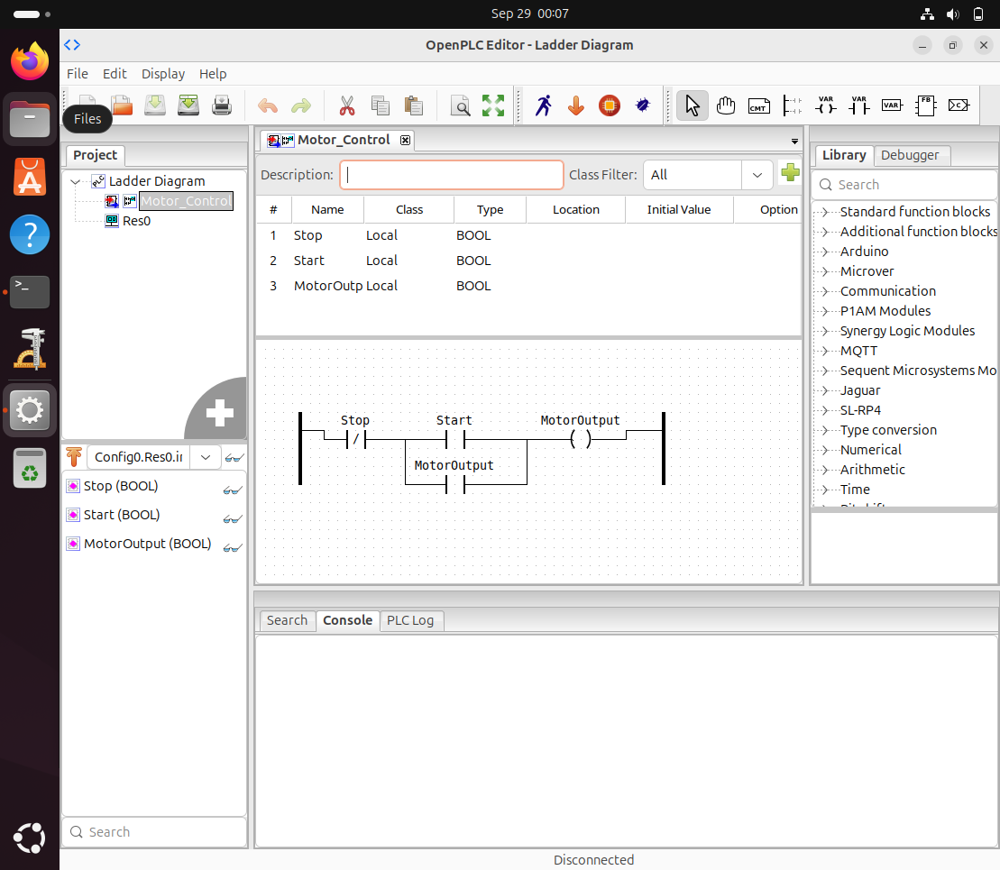
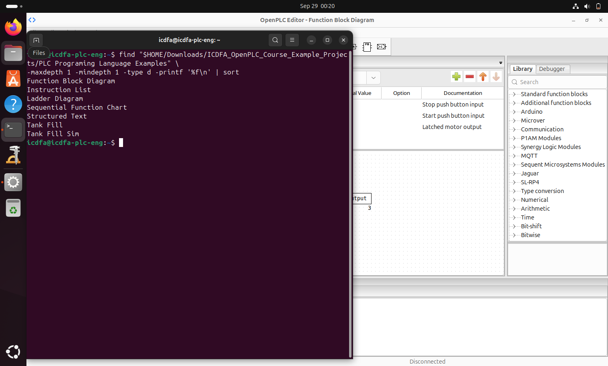
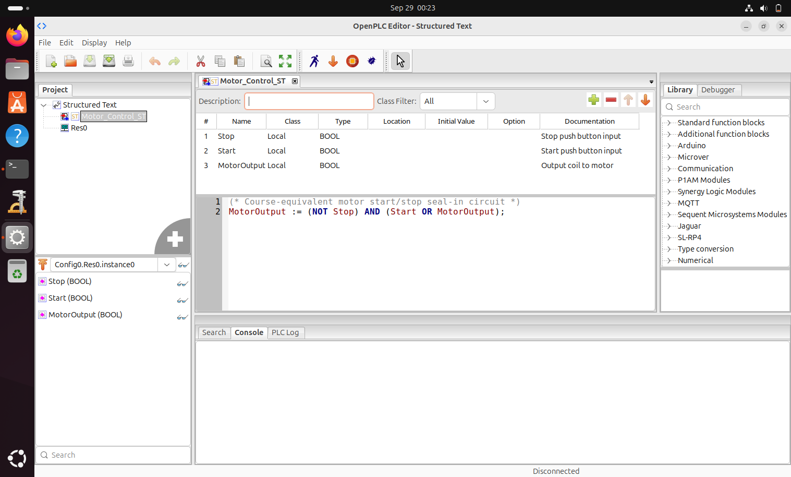
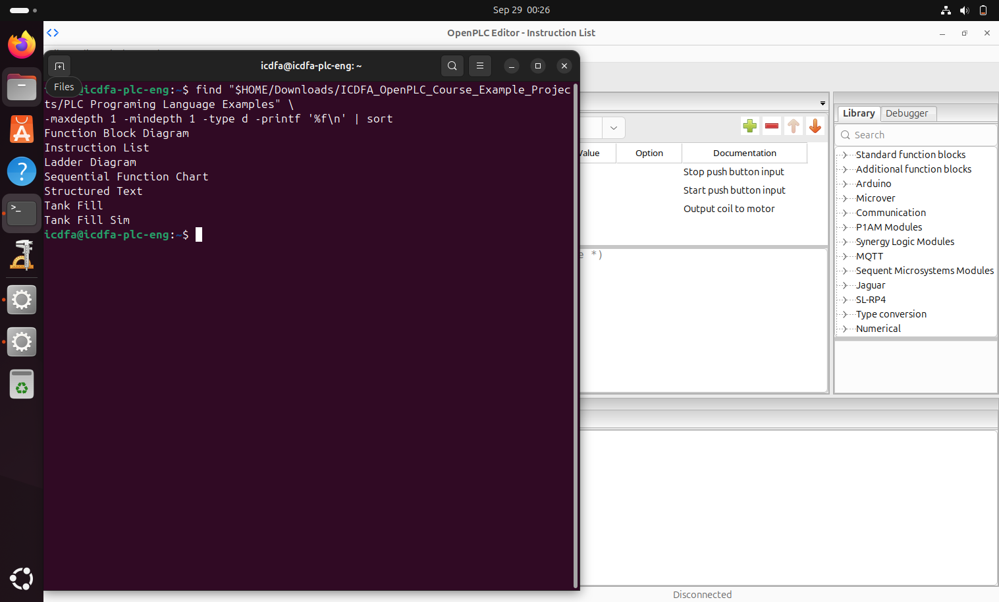
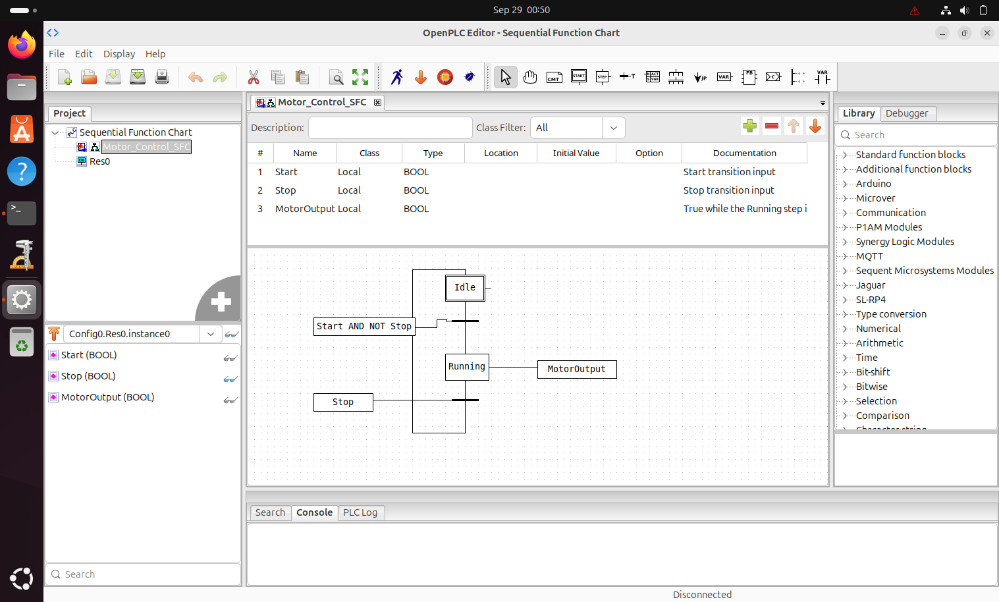

# Lab 02 — PLC Programming Languages and Motor Control Logic

## Objective

The objective of this laboratory was to examine how the same PLC motor-control requirement can be represented using five industrial PLC programming approaches:

1. Ladder Diagram (LD)
2. Function Block Diagram (FBD)
3. Structured Text (ST)
4. Instruction List (IL)
5. Sequential Function Chart (SFC)

The supplied ICDFA OpenPLC projects were inspected using OpenPLC Editor within the authorized PLC Engineering virtual machine.

---

## Evidence 01 — Ladder Diagram



The `Motor_Control` Ladder Diagram uses three Boolean variables:

- `Start`
- `Stop`
- `MotorOutput`

The normally closed `Stop` contact permits operation while the stop condition is inactive. The normally open `Start` contact initially energizes the `MotorOutput` coil.

A parallel normally open `MotorOutput` contact provides the seal-in or latching path. Once `MotorOutput` is energized, this feedback contact keeps the rung true after the Start command is released.

Activating `Stop` breaks the control path, de-energizes `MotorOutput`, and releases the latch.

---

## Evidence 02 — Function Block Diagram



The Function Block Diagram represents the same control requirement using interconnected Boolean logic blocks.

`Start` and the existing `MotorOutput` state enter an `OR` block. This provides the feedback required to maintain the output after the initial Start command.

The `Stop` condition is inverted using a `NOT` block and combined with the latching condition through an `AND` block.

The resulting relationship is:

`MotorOutput = (Start OR MotorOutput) AND NOT Stop`

The `MotorOutput` feedback path therefore performs the same seal-in function implemented by the parallel contact in Ladder Diagram.

---
## Evidence 03 — Structured Text



The supplied Structured Text program is named `Motor_Control_ST`.

The complete motor-control relationship is expressed as:

```text
MotorOutput := (NOT Stop) AND (Start OR MotorOutput);
```

The expression can be interpreted as follows:

- `NOT Stop` provides the stop permissive condition.
- `Start` provides the initial start command.
- `MotorOutput` provides the feedback condition required to retain the output.
- `Start OR MotorOutput` implements the seal-in relationship.
- The final `AND` operation ensures that the motor remains active only while the Stop condition is inactive.

Structured Text therefore represents the same control logic much more compactly than the graphical Ladder Diagram and Function Block Diagram representations.

It is particularly useful where PLC programs require mathematical operations, complex Boolean expressions, data processing, loops, conditional logic, or algorithms that would be cumbersome to represent graphically.

---

## Evidence 04 — Instruction List



The supplied Instruction List program is named `Motor_Control_IL`.

The program contains the following sequence:

```text
LD Start
OR MotorOutput
ANDN Stop
ST MotorOutput
```

The instructions perform the following operations:

- `LD Start` loads the current value of the Start condition.
- `OR MotorOutput` combines Start with the existing motor-output state to provide feedback.
- `ANDN Stop` requires the Stop condition to be false.
- `ST MotorOutput` stores the resulting Boolean value in `MotorOutput`.

The resulting logical relationship is equivalent to:

```text
MotorOutput = (Start OR MotorOutput) AND NOT Stop
```

Instruction List therefore implements the same motor-control function using sequential mnemonic instructions rather than graphical elements or a higher-level Boolean statement.

Instruction List represents a legacy PLC programming style and is included because it forms part of the supplied ICDFA laboratory exercise and is relevant when reviewing older industrial control systems.

---

## Evidence 05 — Sequential Function Chart



The supplied Sequential Function Chart program is named `Motor_Control_SFC`.

The chart contains two principal operating steps:

- `Idle`
- `Running`

`Idle` is the initial step.

The process transitions from `Idle` to `Running` when the following transition condition becomes true:

```text
Start AND NOT Stop
```

When the `Running` step becomes active, the associated `MotorOutput` action is active.

The process remains in the running state until the following transition condition becomes true:

```text
Stop
```

When `Stop` becomes true, the sequence transitions back to `Idle`, removing the active motor-output state.

The sequence can therefore be represented conceptually as:

```text
Idle
  |
  | Start AND NOT Stop
  v
Running
  |
  | MotorOutput active
  |
  | Stop
  v
Idle
```

Sequential Function Chart differs significantly from the other four representations because it models the control requirement explicitly as process states, transitions, and actions.

---

## Evidence 06 — Programming-Language Comparison

| Language | Representation | Motor-control implementation | Main characteristic |
|---|---|---|---|
| Ladder Diagram (LD) | Graphical contacts, branches, and coils | Normally closed Stop, normally open Start, MotorOutput seal-in contact, and MotorOutput coil | Closely resembles traditional electrical relay-control diagrams |
| Function Block Diagram (FBD) | Connected Boolean logic blocks | Start and MotorOutput feedback through `OR`, combined with `NOT Stop` through `AND` | Makes logical signal flow and functional relationships visually explicit |
| Structured Text (ST) | High-level textual expression | `MotorOutput := (NOT Stop) AND (Start OR MotorOutput);` | Compact and suitable for calculations, algorithms, and complex logic |
| Instruction List (IL) | Sequential mnemonic instructions | `LD`, `OR`, `ANDN`, and `ST` operations | Low-level instruction-oriented representation commonly encountered in legacy PLC systems |
| Sequential Function Chart (SFC) | Steps, transitions, and actions | `Idle` → `Running` → `Idle` using Start and Stop transition conditions | Well suited to sequential processes and state-oriented control |

### Comparison

Ladder Diagram is highly intuitive for technicians familiar with relay circuits because its contacts and coils closely resemble conventional electrical control drawings.

Function Block Diagram emphasizes the relationship between functional elements and makes Boolean data flow easy to visualize.

Structured Text provides a compact textual representation and is generally better suited to complex logic, calculations, data manipulation, and algorithmic control.

Instruction List expresses the same logic through individual mnemonic operations and provides insight into older or legacy PLC implementations.

Sequential Function Chart represents process behavior using explicit operating states and transitions, making it particularly useful for sequential industrial processes.

---

## Evidence 07 — Equivalent Motor-Control Behaviour

Although the five programming representations use different structures, they implement the same fundamental motor-control objective.

The required process behaviour is:

1. The motor remains stopped initially.
2. The motor starts when the Start condition becomes active.
3. The motor remains active after the Start command is released.
4. The motor stops when the Stop condition becomes active.

### Ladder Diagram

The retained motor state is implemented using a parallel `MotorOutput` seal-in contact.

### Function Block Diagram

The retained state is implemented using:

```text
Start OR MotorOutput
```

combined with:

```text
NOT Stop
```

through an `AND` operation.

### Structured Text

The same relationship is expressed directly as:

```text
MotorOutput := (NOT Stop) AND (Start OR MotorOutput);
```

### Instruction List

The equivalent Boolean operations are executed sequentially:

```text
LD Start
OR MotorOutput
ANDN Stop
ST MotorOutput
```

### Sequential Function Chart

The same operating objective is expressed through state transitions:

```text
Idle
  |
  | Start AND NOT Stop
  v
Running
  |
  | Stop
  v
Idle
```

While the syntax and representation differ significantly, the underlying process-control requirement remains consistent:

```text
Start → Motor ON → Motor remains ON → Stop → Motor OFF
```

This demonstrates that PLC programming languages can provide different engineering views of the same control requirement.

---

## Technical Observations

The practical demonstrated several important characteristics of PLC programming.

First, Boolean control logic can be represented either graphically or textually without changing the underlying process requirement.

Second, feedback is central to the motor-latching logic. In Ladder Diagram this appears as a seal-in contact, while FBD, ST, and IL represent the same feedback using the current `MotorOutput` value.

Third, SFC approaches the problem differently by representing the process as operating states rather than directly expressing a Boolean latch.

The practical also showed why engineers working with industrial control systems may need to understand several PLC programming styles. Existing industrial environments may contain controllers developed at different times, by different vendors, or using different programming conventions.

---

## Conclusion

This laboratory demonstrated how a single industrial motor-control requirement can be implemented using multiple PLC programming approaches.

Ladder Diagram emphasizes relay-style control logic.

Function Block Diagram emphasizes interconnected logical operations and signal flow.

Structured Text expresses the behaviour through a compact Boolean statement.

Instruction List represents the control logic through sequential mnemonic instructions.

Sequential Function Chart represents the process through operating states, transitions, and actions.

Despite these representational differences, each supplied program implements the same fundamental operational requirement: the motor starts when commanded, remains active through a retained control condition, and stops when the Stop condition becomes active.

Understanding these different programming representations is important when reviewing, troubleshooting, maintaining, or assessing industrial automation systems because equivalent physical-process behaviour may be implemented using substantially different PLC programming methods.
