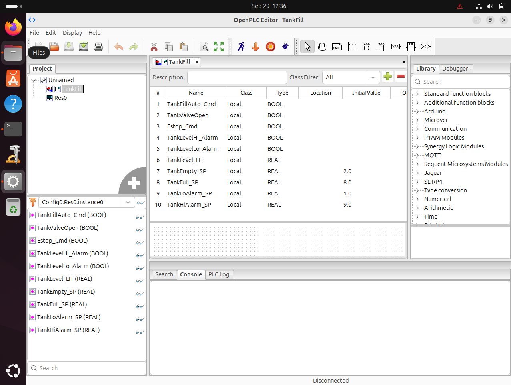
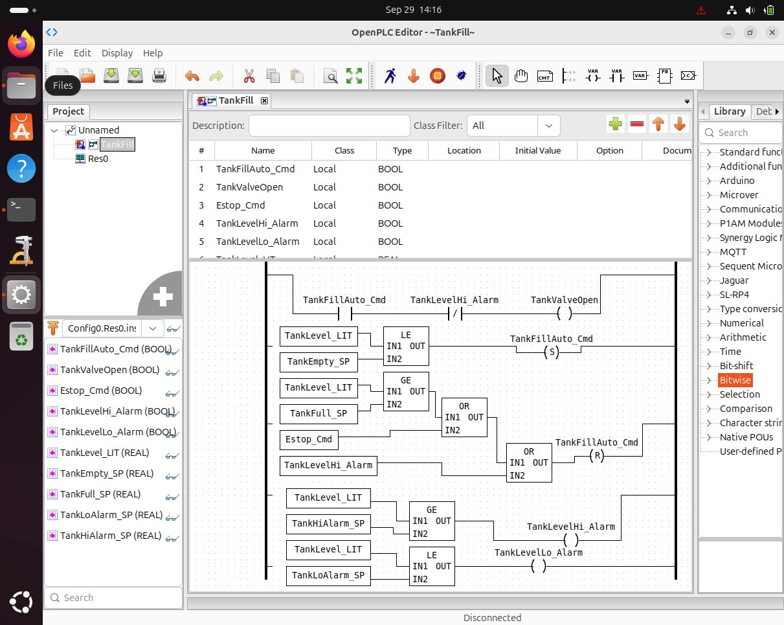

# Lab 03 — Building Your First PLC Program

## Objective

The objective of this laboratory was to create a new OpenPLC Ladder Diagram program for an automated tank-fill process.

The program was designed to:

- automatically begin filling when the tank reaches the empty setpoint;
- stop automatic filling when the full setpoint is reached;
- stop filling when an emergency-stop condition is active;
- prevent valve operation during a high-level alarm;
- generate independent high- and low-level alarm states.

The practical was completed within the authorized ICDFA PLC Engineering virtual machine using OpenPLC Editor.

---

## Project

The OpenPLC project was created as:

```text
TankFill
```

The project contains the source files:

```text
project/TankFill/beremiz.xml
project/TankFill/plc.xml
```

The Ladder Diagram POU is named:

```text
TankFill
```

---

## Variable Plan

The program uses five Boolean variables for discrete states and commands and five Real variables for process measurement and setpoints.

| Variable | Type | Purpose / Initial Value |
|---|---|---|
| `TankFillAuto_Cmd` | BOOL | Internal automatic-fill latch/command |
| `TankValveOpen` | BOOL | Fill-valve command/status |
| `Estop_Cmd` | BOOL | Emergency-stop condition |
| `TankLevelHi_Alarm` | BOOL | High-level alarm |
| `TankLevelLo_Alarm` | BOOL | Low-level alarm |
| `TankLevel_LIT` | REAL | Measured tank level in feet |
| `TankEmpty_SP` | REAL | Automatic fill start setpoint = `2.0 ft` |
| `TankFull_SP` | REAL | Automatic fill stop setpoint = `8.0 ft` |
| `TankLoAlarm_SP` | REAL | Low-level alarm setpoint = `1.0 ft` |
| `TankHiAlarm_SP` | REAL | High-level alarm setpoint = `9.0 ft` |

---

## Evidence 01 — Completed Variable Table



The OpenPLC variable table shows all required BOOL and REAL variables together with the four configured operating setpoints.

---

## Ladder Logic Design

### Rung 1 — Valve Control

The fill valve is energized only when automatic filling is commanded and the high-level alarm is not active.

```text
TankFillAuto_Cmd AND NOT TankLevelHi_Alarm
        →
TankValveOpen
```

This provides an additional protective condition because a high-level alarm prevents the fill valve from remaining commanded open.

### Rung 2 — Automatic Fill Start

Automatic filling is latched when the measured tank level falls to or below the empty setpoint.

```text
TankLevel_LIT <= TankEmpty_SP
        →
SET TankFillAuto_Cmd
```

With the configured value:

```text
TankEmpty_SP = 2.0 ft
```

the automatic-fill command is set when the level reaches 2.0 ft or lower.

### Rung 3 — Automatic Stop and Safety Reset

The automatic-fill command is reset when any of three conditions becomes true:

```text
TankLevel_LIT >= TankFull_SP
OR Estop_Cmd
OR TankLevelHi_Alarm
        →
RESET TankFillAuto_Cmd
```

The normal full-tank stopping point is:

```text
TankFull_SP = 8.0 ft
```

The emergency-stop and high-level alarm conditions independently override normal automatic filling.

### Rung 4 — High-Level Alarm

```text
TankLevel_LIT >= TankHiAlarm_SP
        →
TankLevelHi_Alarm
```

The configured high-alarm setpoint is:

```text
TankHiAlarm_SP = 9.0 ft
```

### Rung 5 — Low-Level Alarm

```text
TankLevel_LIT <= TankLoAlarm_SP
        →
TankLevelLo_Alarm
```

The configured low-alarm setpoint is:

```text
TankLoAlarm_SP = 1.0 ft
```

---

## Evidence 02 — Completed Ladder Program



The completed Ladder Diagram contains the valve-control rung, automatic SET logic, automatic/safety RESET logic, high-level alarm logic, and low-level alarm logic.

---

## Logic Test Table

The following table documents the **expected settled logic state** for six required operating scenarios. These values are derived from the implemented Ladder Diagram and are not presented as measurements from a live physical process.

| Scenario | Tank Level | E-stop | Expected `TankFillAuto_Cmd` | Expected `TankValveOpen` | Expected High Alarm | Expected Low Alarm |
|---|---:|---|---|---|---|---|
| Empty tank | 2.0 ft | FALSE | TRUE | TRUE | FALSE | FALSE |
| Normal filling | 5.0 ft | FALSE | TRUE* | TRUE | FALSE | FALSE |
| Full tank | 8.0 ft | FALSE | FALSE | FALSE | FALSE | FALSE |
| High-level alarm | 9.0 ft | FALSE | FALSE | FALSE | TRUE | FALSE |
| Low-level alarm | 1.0 ft | FALSE | TRUE | TRUE | FALSE | TRUE |
| Emergency stop | 5.0 ft | TRUE | FALSE | FALSE | FALSE | FALSE |

`*` For the normal-filling scenario, `TankFillAuto_Cmd` is assumed to have previously been latched when the tank reached the empty threshold. It remains set until one of the RESET conditions becomes true.

---

## Emergency-Stop Safety Explanation

The emergency-stop condition must override normal automatic filling because safety-related commands require priority over routine process-control objectives.

In this program, `Estop_Cmd` is one of the conditions that resets `TankFillAuto_Cmd`. When the emergency-stop state becomes TRUE, the automatic-fill latch is reset regardless of the tank level or normal filling demand.

Resetting the automatic-fill command also removes the permissive condition required for `TankValveOpen`. This prevents the automatic sequence from continuing during an abnormal or unsafe condition.

The logic therefore gives the emergency-stop condition direct authority to interrupt normal automatic operation.

---

## Validation

The project was saved and subjected to the build/validation functionality available in the installed OpenPLC Editor environment.

No validation or compilation error was reported during the build process.

The resulting project directory contained generated build artifacts including:

```text
build/generated_plc.st
build/Config0.c
build/Res0.c
build/TankFill.so
```

The final `plc.xml` was also parsed successfully as valid XML, and all ten required variables were verified in the saved project.

Only the reusable OpenPLC project source files are included in this repository:

```text
project/TankFill/beremiz.xml
project/TankFill/plc.xml
```

Generated object files, shared libraries, and temporary build artifacts are not included.

---

## Knowledge Check

### 1. Why are BOOL and REAL appropriate data types for this project?

`BOOL` is appropriate for two-state process conditions such as commands, alarms, valve states, and emergency-stop status.

`REAL` is appropriate for continuously varying numerical process quantities such as the measured tank level and the operating/alarm setpoints expressed in feet.

### 2. What is the purpose of a SET/RESET pair for `TankFillAuto_Cmd`?

The SET instruction latches `TankFillAuto_Cmd` when the tank reaches the empty threshold. The command therefore remains active after the level rises above the empty setpoint.

The RESET instruction clears that latched command when the tank reaches the full setpoint or when a safety condition such as the emergency stop or high-level alarm becomes active.

### 3. What should happen if the tank reaches 9 ft while the fill valve remains commanded open?

At 9 ft, the condition:

```text
TankLevel_LIT >= TankHiAlarm_SP
```

becomes true and `TankLevelHi_Alarm` is energized.

The high-level alarm participates in the RESET logic for `TankFillAuto_Cmd`, and the valve-control rung also requires:

```text
NOT TankLevelHi_Alarm
```

Therefore the automatic-fill command is reset and the fill-valve command is removed.

### 4. Why should PLC logic be validated in simulation before use with physical equipment?

Validation and simulation allow control logic, setpoints, alarms, sequencing, and safety responses to be checked before the program influences physical equipment.

This reduces the risk that programming errors, incorrect conditions, or unintended sequences cause unsafe or disruptive physical-process behaviour.

---

## Conclusion

This laboratory demonstrated the development of a complete Ladder Diagram control program for an automated tank-fill process.

The program implements automatic start and stop thresholds, a latched automatic-fill command, high- and low-level alarm conditions, fill-valve interlocking, and an emergency-stop override.

The exercise also demonstrated the importance of defining appropriate PLC data types, separating normal control behaviour from safety override conditions, validating logic before deployment, and preserving clear technical evidence of the implemented control strategy.
