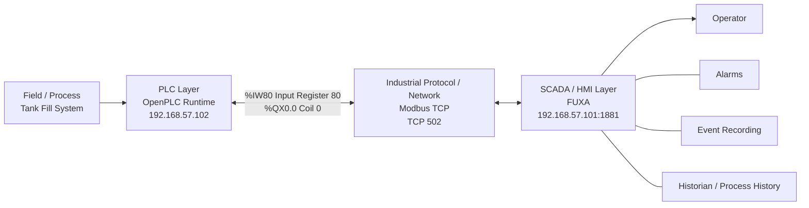
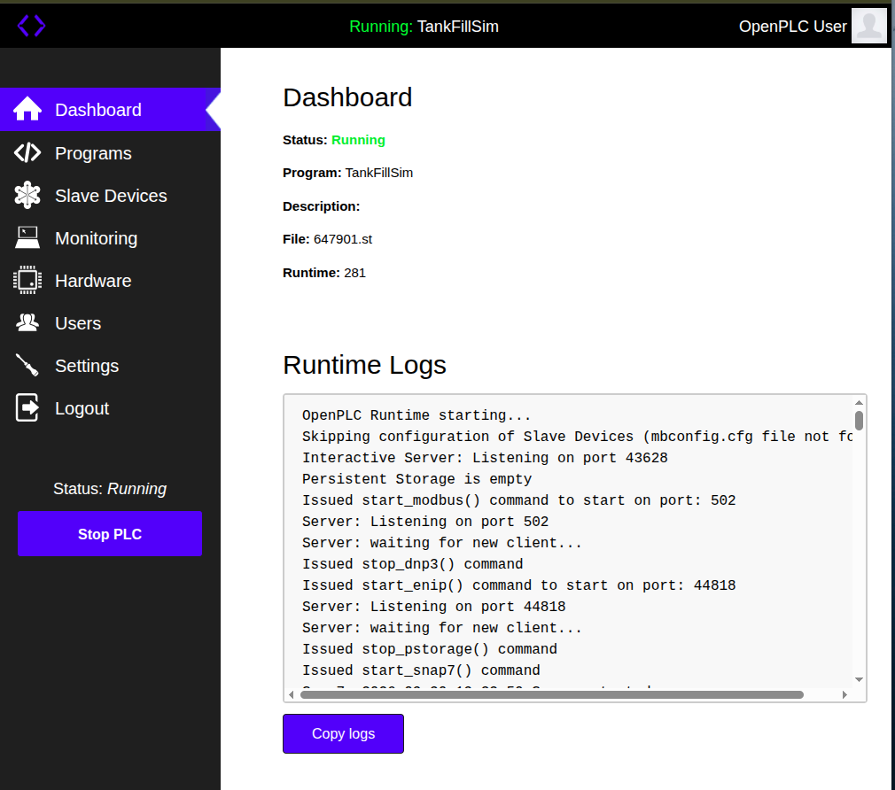
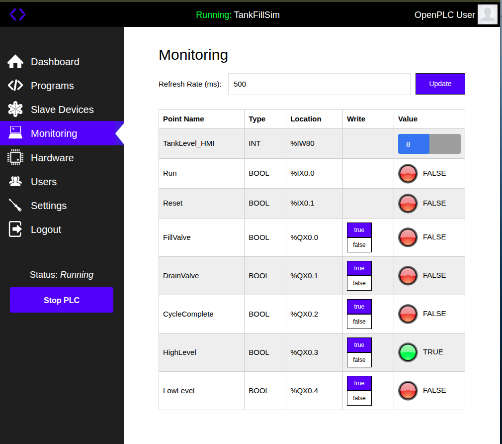
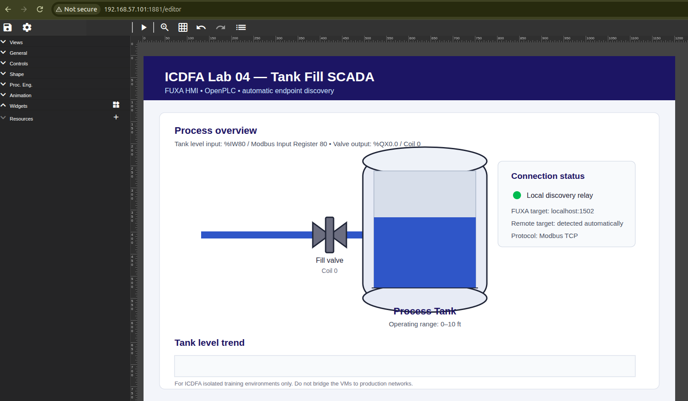
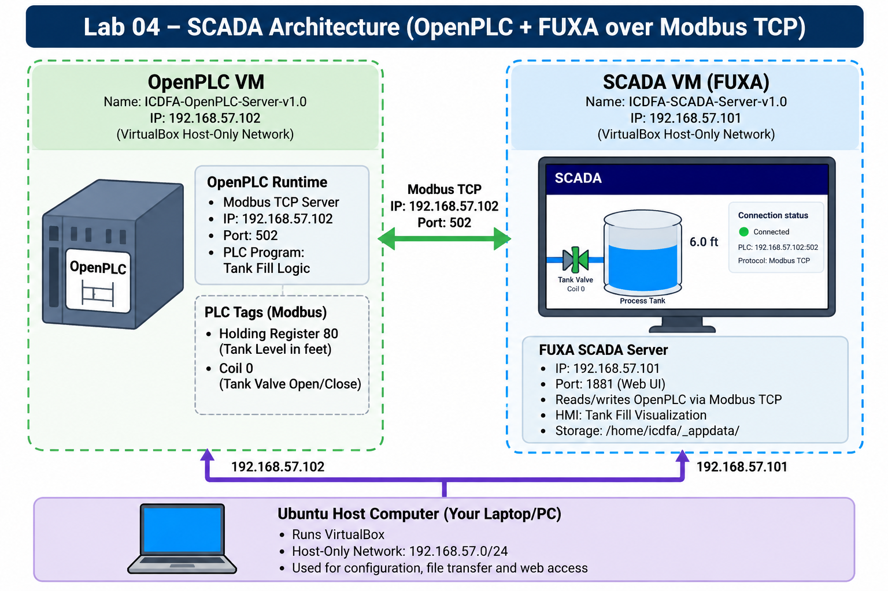

# Lab 04 — Introduction to Supervisory Control and Data Acquisition (SCADA)

**Course:** Intro to Critical Infrastructure for IT Learners  
**Environment:** Authorized ICDFA training virtual machines on an isolated VirtualBox host-only network  
**Date completed:** 30 September 2026  

> **Student Name:** Praise Nze

> **Registration Number:** C11/26/ACIS/17358

---

## 1. Objective

The purpose of this lab was to demonstrate how a PLC and a SCADA/HMI system work together in an industrial-control environment. OpenPLC was used to execute the Tank Fill simulation, while FUXA provided the supervisory HMI. The PLC and SCADA virtual machines communicated over Modbus TCP on an isolated VirtualBox host-only network.

The lab also demonstrated the distinct roles of PLC control logic, HMI visualization, alarms, event recording, historization, and operator context.

---

## 2. Laboratory Environment

| Component | Address / Port | Role |
|---|---|---|
| PLC VM | `192.168.57.102` | OpenPLC Runtime |
| OpenPLC Web UI | `192.168.57.102:8080` | Program upload, compile, start/stop, monitoring |
| Modbus TCP | `192.168.57.102:502` | PLC–SCADA communications |
| SCADA VM | `192.168.57.101` | FUXA SCADA/HMI |
| FUXA Web UI | `192.168.57.101:1881` | HMI editor/runtime |
| VirtualBox host-only network | `192.168.57.0/24` | Isolated training network |

The instructor manual requires an isolated training network and allows updated addressing when the instructor-provided environment differs from the printed example. The working environment therefore used the verified `192.168.57.0/24` host-only network rather than the example addresses printed in the manual.

---

## 3. OpenPLC Tank Fill Program

The `TankFillSim` program was successfully prepared, compiled and loaded into OpenPLC Runtime.

The final runtime status was:

- **Program:** `TankFillSim`
- **Runtime:** `Running`
- **Modbus TCP server:** Listening on TCP port `502`

### Relevant Process Variables

| Variable | PLC Address | Modbus Mapping | Purpose |
|---|---|---|---|
| `TankLevel_HMI` | `%IW80` | Input Register 80 | Tank level shown on the HMI |
| `FillValve` | `%QX0.0` | Coil 0 | Fill-valve state |
| `DrainValve` | `%QX0.1` | Coil 1 | Drain-valve state |
| `CycleComplete` | `%QX0.2` | Coil 2 | Cycle completion state |
| `HighLevel` | `%QX0.3` | Coil 3 | High-level indication |
| `LowLevel` | `%QX0.4` | Coil 4 | Low-level indication |

A direct Modbus test confirmed that Input Register 80 and Coil 0 were accessible from the host and that the process values changed while the simulation was running.

Observed tank-level values included:

`5 → 5 → 6 → 7 → 7 → 8 → 7 → 7 → 6 → 5 → 5 → 4 → 3 → 3 → 2 → 2`

The fill valve was `TRUE` during the filling portion of the cycle and changed to `FALSE` during the hold/drain portion.

---

## 4. FUXA SCADA/HMI

FUXA was used as the supervisory HMI for the Tank Fill process.

The FUXA project initially failed to save because the project database directory under:

`/home/icdfa/_appdata`

was owned by `root`, while the FUXA service itself ran under the `icdfa` account. After correcting ownership of the FUXA application-data directory, the project was successfully written to FUXA and the API returned:

`HTTP status: 200`

The HMI project then loaded successfully and displayed the Tank Fill process.

The HMI used the same verified process mappings:

- Tank level: `%IW80` / Modbus Input Register 80
- Fill valve: `%QX0.0` / Modbus Coil 0

---

## 5. SCADA Architecture

The architecture required by the lab is:

This reflects the required conceptual path:

**Field/Process → PLC → Industrial Protocol/Network → SCADA/HMI → Operator**

Alarms, event recording and historization belong conceptually at the SCADA layer because they provide operator-facing context, traceability and historical process information.

---

## 6. PLC Control Logic vs SCADA/HMI Supervisory Visualization

The PLC and the SCADA/HMI perform different but complementary functions in an industrial control system. The PLC executes the real-time control logic that directly determines how the process behaves. In this lab, OpenPLC ran the Tank Fill simulation, changed the fill and drain valve states, evaluated the tank level and continuously updated the process variables. This control logic remains responsible for the process itself and does not depend on the HMI to make the basic automation sequence operate.

The SCADA/HMI layer provides supervisory visibility rather than replacing the PLC logic. FUXA reads PLC data over Modbus TCP and converts raw process values into information that an operator can understand. The tank level is displayed graphically, while the valve state shows whether filling is active. In a larger SCADA system, the same supervisory layer can also provide alarms, event records, trends and historized process data.

This separation is important because the PLC remains responsible for deterministic control, while the HMI gives the operator process context, status and historical information needed for monitoring and decision-making.

---

## 7. Knowledge Check

### 1. What is the primary purpose of an HMI in a SCADA system?

An HMI provides operators with a graphical view of the industrial process. It presents process measurements, equipment states, alarms and trends so that operators can understand current conditions and supervise the system.

### 2. What is the difference between an alarm, an event record and historized process data?

An **alarm** indicates a process condition that requires operator awareness or action. An **event record** logs an action or state change that occurred at a particular time. **Historized process data** stores process measurements over time so that trends, past performance and abnormal conditions can be reviewed later.

### 3. Why should a SCADA operator have context rather than only raw sensor values?

A raw value alone may not show whether a process condition is normal, abnormal or changing. Context such as engineering units, operating limits, equipment states, alarms and trends allows the operator to interpret the process correctly and respond appropriately.

### 4. What role does the PLC play compared with the SCADA application?

The PLC performs the real-time process control and directly manages process logic and outputs. The SCADA application supervises the process by acquiring PLC data, presenting it through the HMI and providing higher-level functions such as alarms, events and historical trending.

---

## 8. Evidence

The required evidence for this lab is stored in the `evidence/` folder.

| Evidence | File | Description |
|---|---|---|
| 01 | `evidence/01_OpenPLC_Runtime_Running.png` | OpenPLC Runtime showing `TankFillSim` in the Running state |
| 02 | `evidence/02_OpenPLC_Tag_Monitoring.png` | OpenPLC Monitoring showing `%IW80`, `%QX0.0` and related process states |
| 03 | `evidence/03_FUXA_TankFill_HMI_Running.png` | FUXA Tank Fill HMI in operation |
| 04 | `evidence/04_SCADA_Architecture_Diagram.png` | Labelled SCADA architecture diagram |

### Evidence Preview

#### Evidence 01 — OpenPLC Runtime Running

#### Evidence 02 — OpenPLC Tag Monitoring

#### Evidence 03 — FUXA Tank Fill HMI

#### Evidence 04 — SCADA Architecture Diagram

---

## 9. Result

Lab 04 was completed successfully.

OpenPLC executed the Tank Fill simulation, the runtime operated in the `Running` state, and Modbus TCP communication on port `502` was verified. The process level at `%IW80` and fill-valve state at `%QX0.0` were successfully read over Modbus. The process cycled through its operating range, and FUXA successfully loaded the Tank Fill HMI for supervisory visualization.

The lab demonstrated the core SCADA relationship between the physical/process layer, PLC control, industrial communications, supervisory HMI functions and the operator.
