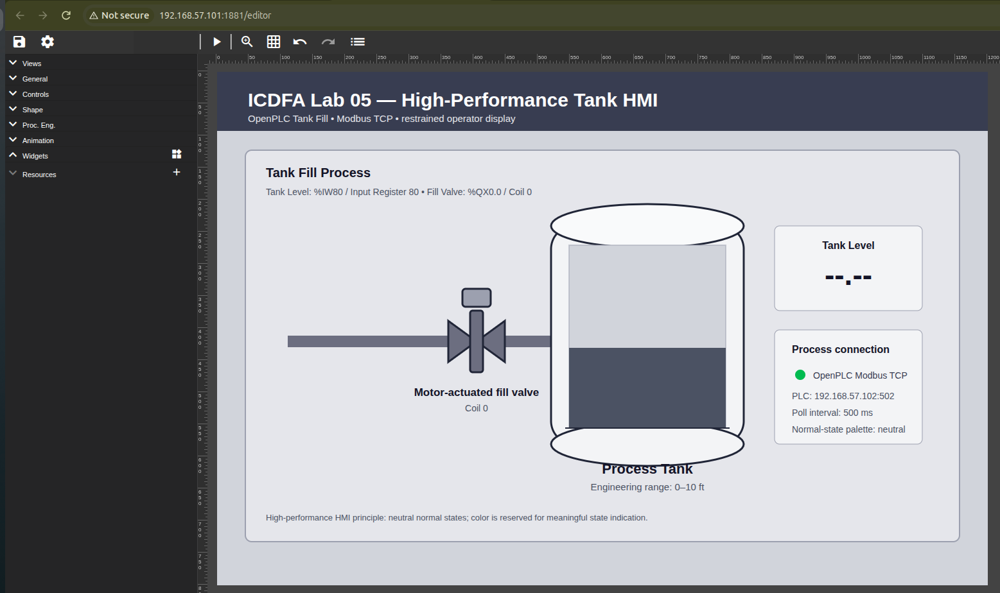
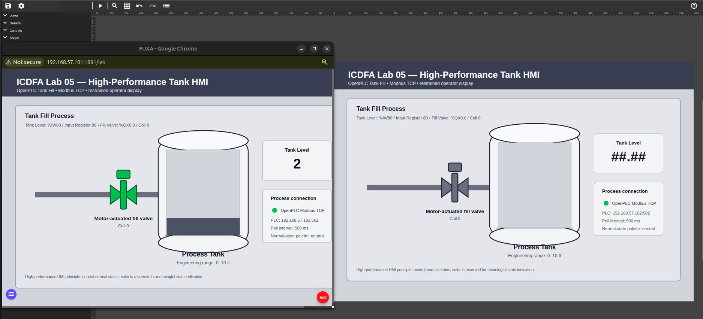
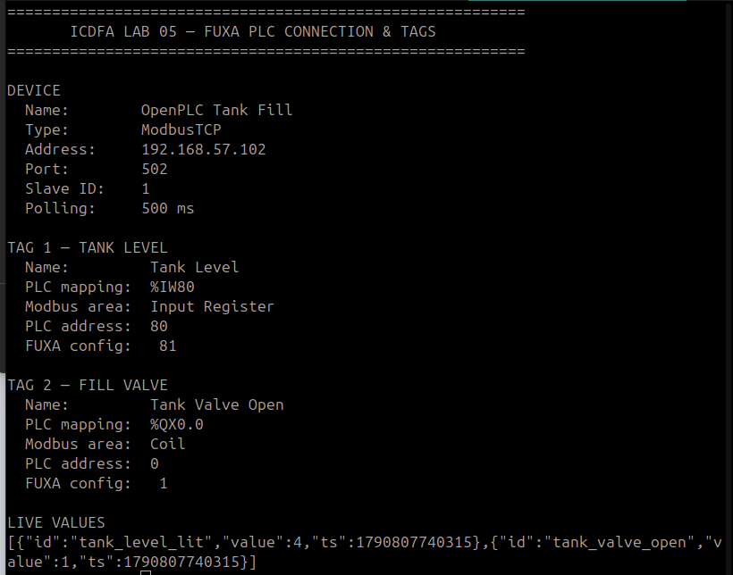

# Lab 05 — Building a SCADA Human Machine Interface

**Course:** Intro to Critical Infrastructure for IT Learners  
**Environment:** Authorized ICDFA training virtual machines on an isolated VirtualBox host-only network  
**Date completed:** 30 September 2026  


> **Student Name:** Praise Nze

> **Registration Number:** C11/26/ACIS/17358

---

## 1. Objective

The purpose of this lab was to build and operate a simple high-performance SCADA/HMI for the OpenPLC Tank Fill simulation using FUXA.

The HMI was designed to provide clear process visibility using a restrained neutral-state palette, a process tank, a level indication, process piping and a motor-actuated fill valve. The HMI was then connected to the running OpenPLC simulation over Modbus TCP so that the tank-level value and valve state reflected the live PLC process.

---

## 2. Laboratory Environment

| Component | Address / Port | Role |
|---|---|---|
| PLC VM | `192.168.57.102` | OpenPLC Runtime |
| OpenPLC Web UI | `192.168.57.102:8080` | PLC runtime management |
| Modbus TCP | `192.168.57.102:502` | PLC–SCADA communications |
| SCADA VM | `192.168.57.101` | FUXA SCADA/HMI |
| FUXA Editor | `192.168.57.101:1881/editor` | HMI design/edit environment |
| FUXA Runtime | `192.168.57.101:1881/lab` | Running HMI |
| VirtualBox host-only network | `192.168.57.0/24` | Isolated training network |

The instructor manual provides example addresses but also states that updated instructor-provided addressing should be used when applicable. This lab therefore used the verified host-only addresses shown above.

---

## 3. PLC Process

The previously prepared `TankFillSim` program was started in OpenPLC Runtime and confirmed as:

`Running: TankFillSim`

The OpenPLC Modbus TCP server was confirmed listening on TCP port `502`.

The relevant PLC process mappings used by the HMI were:

| Process Variable | PLC Address | Modbus Mapping | Behaviour |
|---|---|---|---|
| Tank Level | `%IW80` | Input Register 80 | Integer process value representing tank level |
| Tank Valve Open | `%QX0.0` | Coil 0 | Boolean valve state: closed/open |

During live operation, the tank level cycled through the simulated fill/hold/drain sequence and the fill-valve state changed with the process.

---

## 4. HMI Design

The Lab 05 HMI was implemented in FUXA with a restrained high-performance style.

The design contains:

- a neutral gray background;
- a process tank;
- a tank-level indication with an engineering range of `0–10 ft`;
- process piping;
- a motor-actuated fill valve;
- clear labels for the process and PLC mappings;
- limited use of attention-drawing color.

The valve remains visually neutral when inactive and changes state when the PLC reports the valve as open. This supports rapid operator recognition without unnecessary animation or excessive color.

---

## 5. FUXA Modbus Configuration

The FUXA device used the following connection:

| Setting | Value |
|---|---|
| Device | `OpenPLC Tank Fill` |
| Type | `ModbusTCP` |
| PLC address | `192.168.57.102` |
| Port | `502` |
| Slave / Unit ID | `1` |
| Poll interval | `500 ms` |

### Tag Configuration

| FUXA Tag | PLC Mapping | Actual Modbus Address | FUXA Stored Address |
|---|---|---:|---:|
| `Tank Level` | `%IW80` | Input Register 80 | `81` |
| `Tank Valve Open` | `%QX0.0` | Coil 0 | `1` |

The FUXA Modbus configuration uses one-based addressing internally for these tag fields. Therefore the stored FUXA addresses `81` and `1` correspond to the actual PLC Modbus addresses Input Register `80` and Coil `0`.

This was verified from the live runtime, which returned:

```text
tank_level_lit = 6
tank_valve_open = 1
```

during testing.

---

## 6. Live HMI Verification

The running HMI successfully displayed live PLC data.

Observed behaviour included:

- visible tank-level values in the HMI runtime;
- the tank level changing with the simulated fill/drain cycle;
- the fill-valve graphic changing state with Coil 0;
- live communication through `192.168.57.102:502`.

The final evidence screenshot captured a visible tank level and an open/active fill valve, demonstrating that the HMI was receiving and presenting live PLC process information.

---

## 7. Design Rationale — Situational Awareness

The HMI was designed around simple high-performance HMI principles. The normal process display uses neutral gray tones so that the operator is not distracted by unnecessary color. The tank, pipe and valve are arranged in a simple process-flow layout, making it immediately clear that the valve controls flow into the tank. The tank-level value is displayed prominently and uses engineering units so that the operator can interpret the measurement without needing to infer scale.

Color is reserved for meaningful state indication. In particular, the valve changes visually when the PLC reports that it is open, allowing the operator to correlate equipment state with tank-level movement. The layout avoids decorative animation and unnecessary visual complexity because excessive movement or color can reduce the visibility of important process changes.

This design supports situational awareness by presenting the process hierarchy clearly: current tank level, valve state, process connection and the relationship between the two. The operator can therefore determine whether the process is filling, holding or draining without searching through multiple screens or raw PLC values.

---

## 8. Knowledge Check

### 1. What is a P&ID and how does it influence HMI layout?

A P&ID is a Piping and Instrumentation Diagram. It represents the major process equipment, piping, valves, instruments and their relationships. HMI layouts commonly use the process relationships shown in the P&ID so that the operator can recognize the physical process flow and understand how equipment and measurements relate to one another.

### 2. Why do high-performance HMIs avoid unnecessary animation and excessive color?

Unnecessary animation and excessive color can distract the operator and make abnormal conditions harder to recognize. High-performance HMI design keeps normal states visually restrained and uses attention-drawing color only when it communicates meaningful process state or abnormal conditions.

### 3. How does the Tank Level tag differ from the Tank Valve Open tag in data type and behavior?

The Tank Level tag is an integer process measurement read from `%IW80` / Input Register 80 and changes across the tank's operating range. The Tank Valve Open tag is a Boolean state read from `%QX0.0` / Coil 0 and represents only two logical conditions: closed/inactive or open/active.

### 4. What could happen operationally if an HMI displays stale or incorrect PLC data?

An operator could incorrectly assess the process state and make an inappropriate operational decision. For example, an incorrect level or valve indication could make the operator believe the tank is filling, draining or at a safe level when the actual PLC process is in a different state. This demonstrates why correct data binding and timely process updates are important for situational awareness.

---

## 9. Evidence

The required Lab 05 evidence is stored in the `evidence/` folder.

| Evidence | File | Description |
|---|---|---|
| 01 | `evidence/01_FUXA_HMI_Design_View.png` | FUXA design/edit view showing the tank, valve, piping and neutral HMI layout |
| 02 | `evidence/02_FUXA_HMI_Running.png` | Running FUXA HMI showing a visible live tank-level value and valve state |
| 03 | `evidence/03_FUXA_PLC_Connection_Tags.png` | Verified FUXA PLC connection and tag mappings with sensitive credentials excluded |

### Evidence Preview

#### Evidence 01 — FUXA HMI Design View



#### Evidence 02 — FUXA HMI Running



#### Evidence 03 — FUXA PLC Connection and Tags



---

## 10. Exported Project

The final working FUXA project is stored at:

`project/LAB05_Tank_HMI.json`

This exported project contains the working HMI layout, PLC connection and tag configuration used for the final runtime evidence.

---

## 11. Result

Lab 05 was completed successfully.

A high-performance Tank Fill HMI was built in FUXA and connected to the running OpenPLC `TankFillSim` process over Modbus TCP. The HMI displayed live tank-level data from `%IW80` / Input Register 80 and reflected the valve state from `%QX0.0` / Coil 0.

The final submission includes the design-view screenshot, running-HMI screenshot, connection/tag evidence and the exported FUXA project file required by the laboratory manual.
