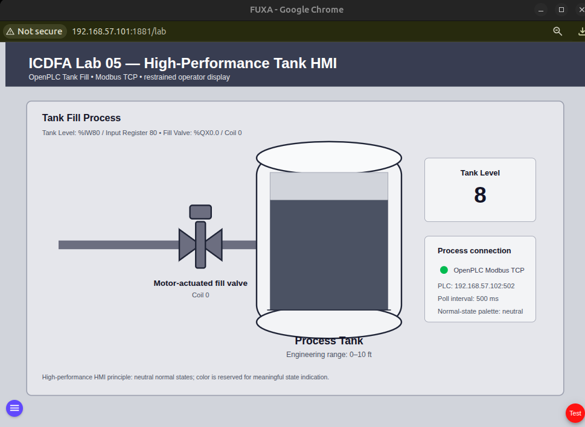
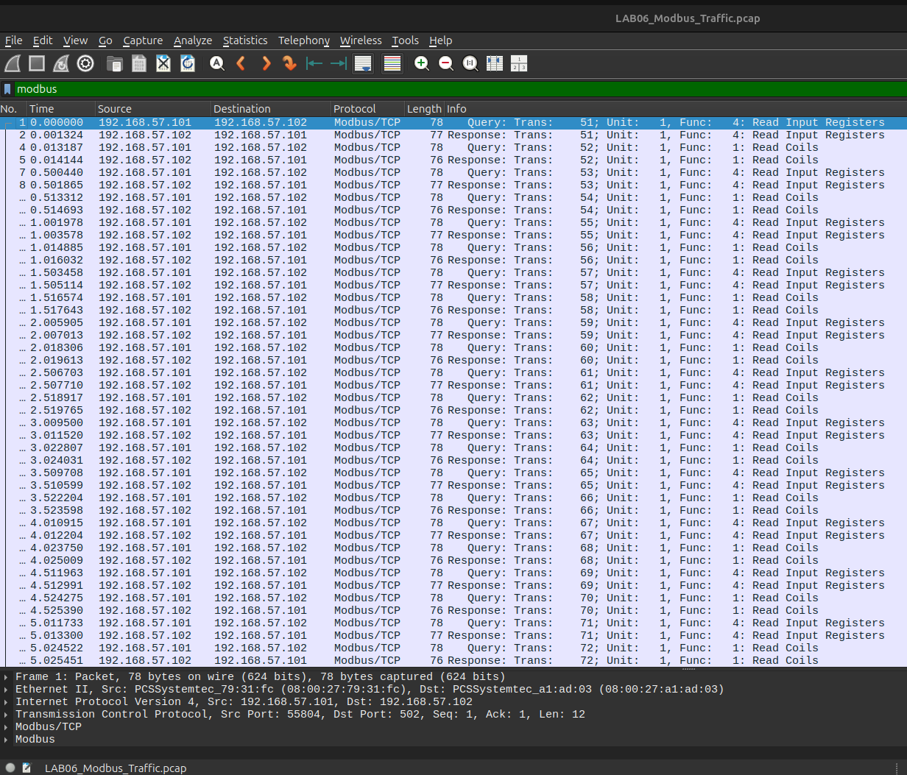
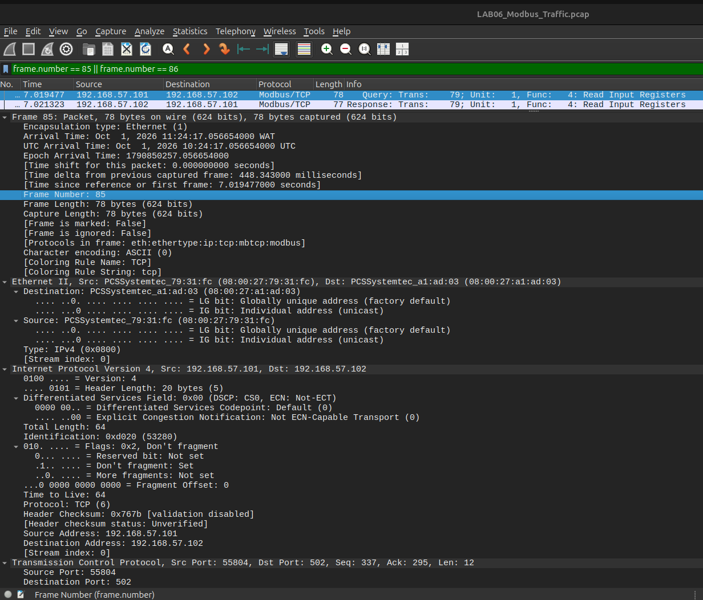

# Lab 06 — Introduction to Modbus

**Course:** Intro to Critical Infrastructure for IT Learners  
**Environment:** Authorized ICDFA training virtual machines on an isolated VirtualBox host-only network  
**Date completed:** 1 October 2026  

> **Student Name:** ______________________________  
> **Registration Number:** ________________________

---

## 1. Objective

The purpose of this lab was to observe and analyze Modbus TCP communication between the FUXA SCADA/HMI and the OpenPLC `TankFillSim` process in the isolated ICDFA training environment.

The lab focused on identifying common Modbus function codes, capturing PLC/SCADA traffic, locating a request/response pair, and relating Modbus register data to the running tank-fill process.

---

## 2. Laboratory Environment

| Component | Address / Interface | Role |
|---|---|---|
| PLC VM | `192.168.57.102` | OpenPLC Runtime |
| SCADA VM | `192.168.57.101` | FUXA SCADA/HMI |
| SCADA capture interface | `enp0s8` | Host-only PLC/SCADA segment |
| Modbus TCP | TCP `502` | Industrial application protocol |
| VirtualBox host-only network | `192.168.57.0/24` | Isolated training network |
| Host analysis tools | Wireshark / TShark | Packet analysis and evidence |

The instructor manual specifies an Analyst/Kali VM. In the available laboratory inventory, only the PLC and SCADA VMs were present. To remain within the isolated training topology, the Modbus traffic was captured directly on the SCADA VM interface `enp0s8`, which carried the PLC/SCADA communication, and the resulting capture was transferred to the host for Wireshark analysis.

---

## 3. Running Process

The OpenPLC `TankFillSim` program was started and confirmed as:

`Running: TankFillSim`

The OpenPLC runtime log confirmed that the Modbus server was listening on:

`TCP port 502`

The FUXA HMI was also running and displaying live process data from the PLC.

Relevant process mappings were:

| Process Variable | PLC Address | Modbus Mapping |
|---|---|---|
| Tank Level | `%IW80` | Input Register 80 |
| Tank Valve Open | `%QX0.0` | Coil 0 |

---

## 4. Modbus Traffic Capture

A 20-second packet capture was taken on the SCADA VM interface:

`enp0s8`

using the capture filter:

`tcp port 502`

The capture file was saved as:

`capture/LAB06_Modbus_Traffic.pcap`

### Capture Results

- Total packets captured: **234**
- TCP/502 packets: **234**
- Modbus packets decoded: **156**
- Function Code 01 packets: **78**
- Function Code 04 packets: **78**
- Kernel packet drops: **0**

The traffic clearly showed bidirectional communication between:

- FUXA / SCADA: `192.168.57.101`
- OpenPLC / PLC: `192.168.57.102`

---

## 5. Modbus Function Codes Observed

Two Modbus function codes were observed repeatedly in the capture:

| Function Code | Function | Observed Use |
|---:|---|---|
| `01` | Read Coils | Read the discrete valve/output state |
| `04` | Read Input Registers | Read the tank-level input register |

The capture therefore demonstrated both discrete Boolean-state polling and 16-bit register polling from the SCADA system.

---

## 6. FC04 Request / Response Analysis

The selected request/response pair was:

### Request — Frame 85

| Field | Value |
|---|---|
| Frame | `85` |
| Time | `7.019477 s` |
| Source | `192.168.57.101:55804` |
| Destination | `192.168.57.102:502` |
| Transaction ID | `79` |
| Function Code | `04 — Read Input Registers` |
| Reference Register | `80` |
| Quantity | `1` register |

### Response — Frame 86

| Field | Value |
|---|---|
| Frame | `86` |
| Time | `7.021323 s` |
| Source | `192.168.57.102:502` |
| Destination | `192.168.57.101:55804` |
| Transaction ID | `79` |
| Function Code | `04 — Read Input Registers` |
| Byte Count | `2` |
| Register Value | `8` |

### Interpretation

Frame 85 shows the FUXA SCADA system requesting one input register from OpenPLC using Modbus Function Code 04. The requested register was Input Register 80, which is mapped to the Tank Level value in the Tank Fill simulation.

Frame 86 is the corresponding OpenPLC response. The matching Transaction ID `79` links the response to the request. The returned 16-bit register value was `8`, which represents the live tank-level indication at that moment in the simulation.

This demonstrates how a SCADA/HMI obtains process measurements from a PLC using Modbus TCP.

---

## 7. Modbus Function-Code Reference Table

| Code | Function | Purpose |
|---:|---|---|
| `01` | Read Coils | Reads discrete output/coil states |
| `02` | Read Discrete Inputs | Reads discrete input states |
| `03` | Read Holding Registers | Reads 16-bit holding registers |
| `04` | Read Input Registers | Reads 16-bit input registers |
| `05` | Write Single Coil | Changes one discrete coil |
| `06` | Write Single Holding Register | Changes one holding register |
| `15` | Write Multiple Coils | Changes multiple coils |
| `16` | Write Multiple Holding Registers | Changes multiple registers |

---

## 8. Modbus TCP vs Modbus RTU

Modbus TCP and Modbus RTU use the same general Modbus application model, including function codes and data areas, but they use different transports.

**Modbus TCP** runs over Ethernet using TCP/IP, normally on TCP port `502`. It uses an MBAP header that includes fields such as the Transaction Identifier, Protocol Identifier, Length and Unit Identifier. Because it runs over TCP/IP, devices communicate using IP addresses and TCP ports.

**Modbus RTU** is normally used on serial communication links such as RS-485. It does not use TCP/IP addressing or an MBAP header. Instead, frames include a device/slave address and a CRC for error detection. Communication is typically master/client initiated, with serial timing helping define frame boundaries.

In this lab, Modbus TCP was used because FUXA and OpenPLC communicated across the isolated Ethernet-based VirtualBox network.

---

## 9. Knowledge Check

### 1. What transport/networking difference separates Modbus TCP from Modbus RTU?

Modbus TCP uses Ethernet and TCP/IP, normally communicating over TCP port `502` using IP addresses. Modbus RTU normally uses a serial link such as RS-485 and identifies devices using serial slave addresses rather than IP addresses.

### 2. Why does Modbus use function codes?

Function codes identify the operation that the client wants the server to perform. They indicate whether the request is reading or writing and which Modbus data area is involved, such as coils, discrete inputs, holding registers or input registers.

### 3. What does Function Code 4 request/read?

Function Code 04 reads one or more 16-bit Input Registers. In this lab, FUXA used Function Code 04 to read Input Register 80, which carried the Tank Level value.

### 4. Why is visibility of unprotected industrial protocol traffic a cybersecurity concern?

If industrial protocol traffic is transmitted without confidentiality or strong protection, an observer with access to the network may be able to identify device addresses, function codes, process values and operational patterns. This information could reveal how the process operates and may help an attacker understand the control environment. Segmentation, access control, monitoring and appropriate protocol protections are therefore important in industrial networks.

---

## 10. Evidence

The required Lab 06 evidence is stored in the `evidence/` folder.

| Evidence | File | Description |
|---|---|---|
| 01 | `evidence/01_FUXA_OpenPLC_Process_Running.png` | Running FUXA/OpenPLC Tank Fill process with visible live tank-level value |
| 02 | `evidence/02_Wireshark_Modbus_Filter.png` | Wireshark display filtered to Modbus traffic |
| 03 | `evidence/03_Modbus_FC04_Request_Response_Analysis.png` | FC04 request/response analysis showing register and transaction details |

### Evidence Preview

#### Evidence 01 — Running FUXA/OpenPLC Process

#### Evidence 02 — Wireshark Modbus Filter

#### Evidence 03 — FC04 Request/Response Analysis

---

## 11. Capture and Analysis Files

The packet capture and supporting analysis are stored in:

- `capture/LAB06_Modbus_Traffic.pcap`
- `capture/FC04_analysis.txt`

The capture contains only traffic from the isolated training segment associated with the PLC/SCADA Modbus exchange.

---

## 12. Result

Lab 06 was completed successfully.

The running FUXA HMI communicated with the OpenPLC `TankFillSim` process over Modbus TCP. A live packet capture was collected from the isolated SCADA network interface and analyzed using Wireshark/TShark.

The analysis identified repeated Function Code 01 and Function Code 04 traffic. A specific FC04 request from FUXA to OpenPLC requested Input Register 80, and the corresponding response returned a Tank Level value of `8`. The matching Transaction ID confirmed the request/response relationship.

This lab demonstrated how Modbus TCP function codes, registers, transaction identifiers and process values can be observed and interpreted in an industrial-control environment.
