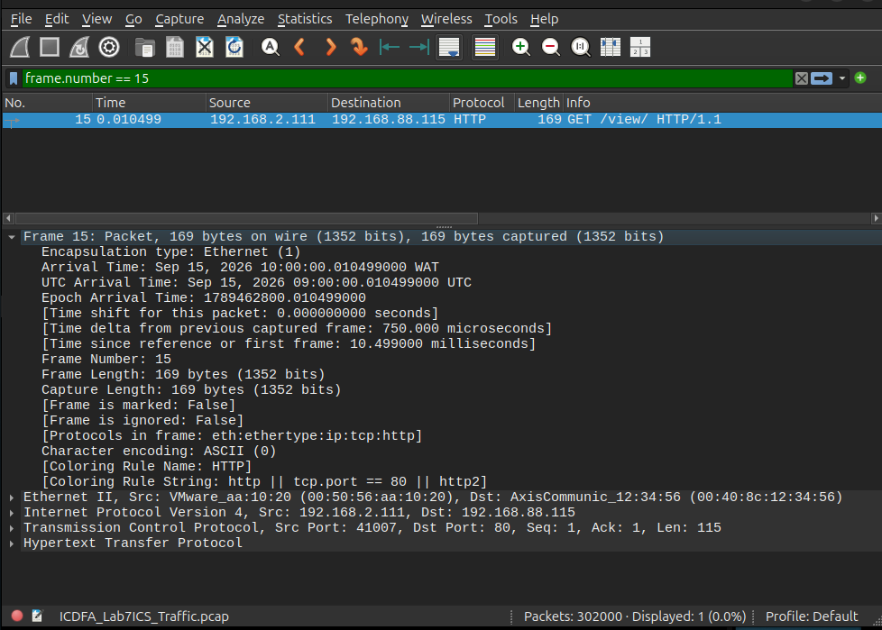
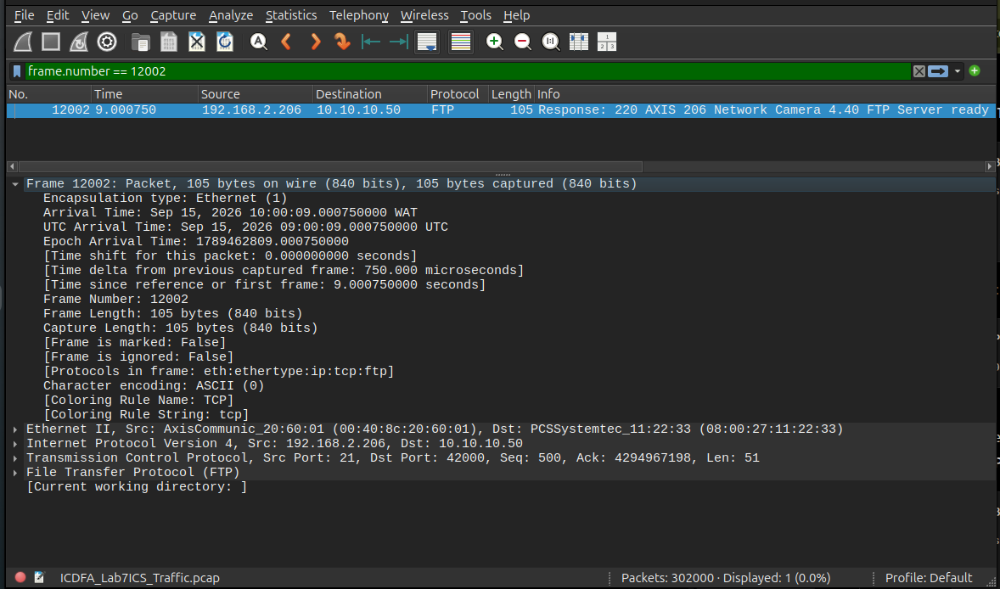
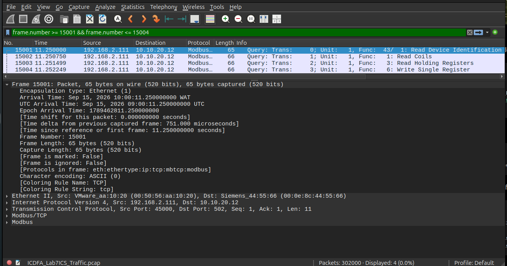
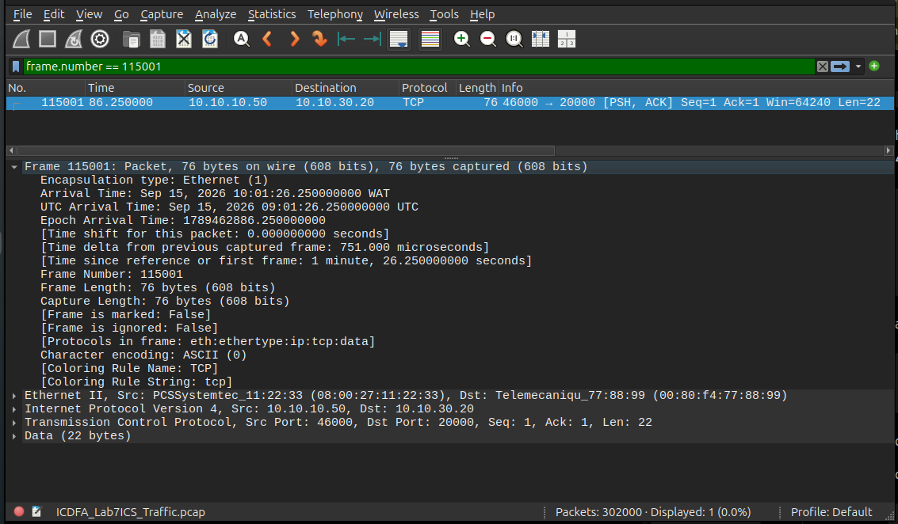
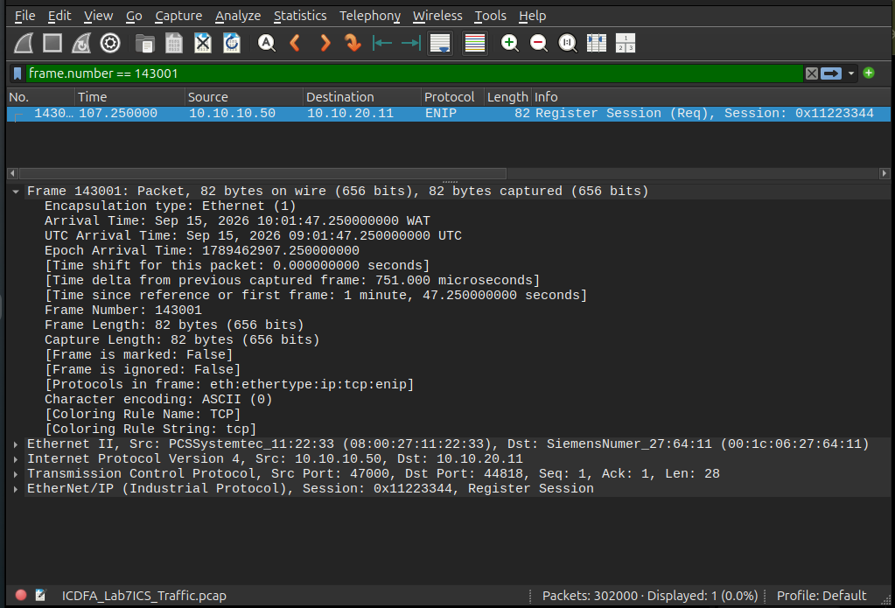
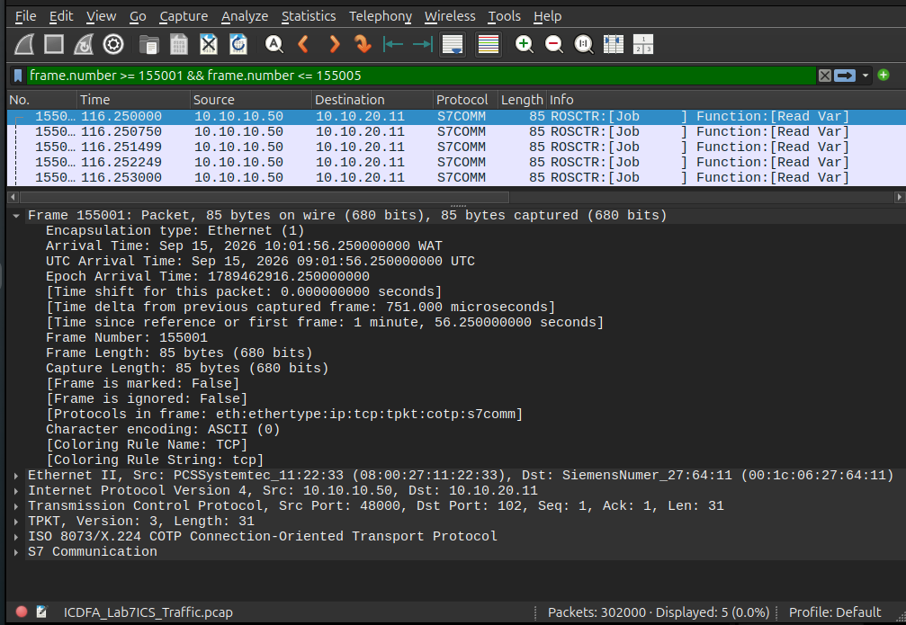

# ACICP301 Practical Lab 07 — Exploring ICS Packet Captures

## Objective

The objective of this practical was to use passive packet analysis to identify and examine conventional IT and industrial-control-system communications in an instructor-provided packet capture.

The analysis focused on:

- HTTP
- FTP
- Modbus/TCP
- DNP3
- EtherNet/IP
- Siemens S7 communication

The exercise was passive. No scanning, exploitation, credential reuse or interaction with captured systems was performed.

---

## Instructor Dataset

The final analysis uses only the instructor-provided packet capture:

`ICDFA_Lab7ICS_Traffic.pcap`

### Capture Properties

| Property | Value |
|---|---|
| Format | PCAP / Ethernet |
| Size | Approximately 144 MB |
| Packets | Approximately 302,000 |
| Duration | 226.499249 seconds |
| Earliest packet | 2026-09-15 10:00:00 |
| Latest packet | 2026-09-15 10:03:46.499249 |
| SHA-256 | `d0ff40d4b212bb9b464689b0a020a6157a6875db5f741decb89a2fc975b8ae6a` |

### Protocol Counts

| Protocol | Packets |
|---|---:|
| HTTP | 12,000 |
| FTP | 3,000 |
| Modbus/TCP | 100,000 |
| DNP3 decoded by Wireshark | 0 |
| EtherNet/IP | 12,000 |
| S7comm | 12,000 |

HTTP-specific analysis also found:

- 5 packets matching `http.authbasic`
- 6,000 HTTP request-method packets
- 54 HTTP POST requests

---

# Evidence

## Evidence 01 — HTTP Basic Authentication

Wireshark filter:

`http.authbasic`

Representative packet:

- Frame: 15
- Source: 192.168.2.111
- Destination: 192.168.88.115
- Method: GET
- URI: `/view/`

The capture contains HTTP Basic Authentication material.

The submitted screenshot intentionally keeps the authentication value hidden. No credential value is reproduced in this report.

### Security Observation

Basic Authentication represents credentials using Base64 encoding rather than encryption. When it is used over unprotected HTTP, an observer with access to the traffic may recover authentication material.

---

## Evidence 02 — FTP Banner and Cleartext Protocol Activity

Wireshark filter:

`ftp`

Representative packet:

- Frame: 12002
- Source: 192.168.2.206
- Destination: 10.10.10.50
- Protocol: FTP
- Service information: AXIS 206 Network Camera 4.40 FTP Server

FTP USER and PASS operations were also observed in the packet capture.

Credential values are deliberately omitted from this report and from the submitted screenshot.

### Security Observation

FTP does not provide native confidentiality for ordinary command-channel traffic. Passive analysis can therefore reveal authentication activity and service metadata such as device type and software information.

---

## Evidence 03 — Modbus/TCP Function Codes

Wireshark selection:

`frame.number >= 15001 && frame.number <= 15004`

Representative packets:

| Frame | Function Code | Operation |
|---:|---:|---|
| 15001 | 43 | Read Device Identification |
| 15002 | 01 | Read Coils |
| 15003 | 03 | Read Holding Registers |
| 15004 | 06 | Write Single Register |

Source:

`192.168.2.111`

Destination:

`10.10.20.12`

### Security Observation

Passive inspection of Modbus/TCP reveals both read and write operations. In this capture an observer can distinguish device-identification requests, coil reads, register reads and register writes.

The capture contains 25,000 occurrences of each of the four observed Modbus function codes:

- FC01
- FC03
- FC06
- FC43

---

## Evidence 04 — DNP3-Shaped TCP Traffic and CRC Validation

The instructor capture contains a block of:

`28,000`

TCP packets using destination port:

`20000`

Representative endpoints:

- Source: 10.10.10.50
- Destination: 10.10.30.20

Representative frame:

`115001`

The TCP payload begins:

`05 64`

which corresponds to the normal DNP3 start sequence.

### Wireshark Decoding Result

Wireshark does not decode these packets as DNP3.

A validation of all 28,000 TCP/20000 payload packets found:

| Validation Result | Count |
|---|---:|
| TCP/20000 payload packets | 28,000 |
| Payloads beginning `05 64` | 28,000 |
| Header CRC equal to `00 00` | 28,000 |
| Valid DNP3 header CRCs | 0 |
| Invalid DNP3 header CRCs | 28,000 |

For frame 115001:

- Header bytes: `05640fc401000004`
- Captured header CRC: `0000`
- Calculated header CRC: `9a11`
- Captured data CRC: `0000`
- Calculated data CRC: `19d7`

The instructor packet capture was not modified.

### Finding

The traffic is therefore documented as **DNP3-shaped traffic with invalid CRC fields**, rather than being represented as successfully decoded DNP3 traffic.

This demonstrates an important packet-analysis principle: a well-known port number and recognizable start bytes alone are not sufficient to establish that a packet is structurally valid for the expected protocol.

---

## Evidence 05 — EtherNet/IP

Wireshark filter:

`enip`

Representative packet:

- Frame: 143001
- Source: 10.10.10.50
- Destination: 10.10.20.11
- Protocol: EtherNet/IP
- Operation: Register Session Request
- Session value shown in the capture: `0x11223344`

### Security Observation

EtherNet/IP session traffic identifies communicating industrial endpoints and exposes information about industrial communication activity to a passive observer.

Some subsequent CIP packets in the dataset are reported by Wireshark as malformed; this report therefore uses the clearly decoded Register Session packet as the principal EtherNet/IP evidence.

---

## Evidence 06 — Siemens S7 Read Var

Wireshark filter:

`s7comm`

Representative packets:

`155001–155005`

Source:

`10.10.10.50`

Destination:

`10.10.20.11`

Observed S7 operation:

`Job — Read Var`

### Security Observation

Repeated S7 Read Var operations allow a passive observer to identify communicating PLC-related endpoints and observe patterns of variable access without sending traffic to the devices.

---

# Protocol Evidence Matrix

| Protocol | Filter / Selection | Endpoints | Observed Operation | Security Significance |
|---|---|---|---|---|
| HTTP | `http.authbasic` | 192.168.2.111 → 192.168.88.115 | Basic-authenticated GET `/view/` | Authentication material may be observable where HTTP lacks transport encryption. |
| FTP | `ftp` | 192.168.2.206 ↔ 10.10.10.50 | FTP banner and authentication operations | Cleartext commands and metadata can expose credentials and device/service information. |
| Modbus/TCP | Frames 15001–15004 | 192.168.2.111 → 10.10.20.12 | FC43, FC01, FC03 and FC06 | Reveals device discovery, read operations and write activity. |
| DNP3-shaped TCP | `tcp.port == 20000` | 10.10.10.50 → 10.10.30.20 | Payload begins `05 64`; invalid CRC prevents normal DNP3 decoding | Demonstrates the need to validate protocol structure rather than relying only on ports. |
| EtherNet/IP | `enip` | 10.10.10.50 → 10.10.20.11 | Register Session Request | Reveals industrial endpoint and session relationships. |
| S7comm | `s7comm` | 10.10.10.50 → 10.10.20.11 | Job — Read Var | Reveals PLC communication and variable-access patterns. |

---

# Security Assessment

The instructor packet capture demonstrates how much operational and security-relevant information can be obtained through passive network analysis.

## 1. HTTP Authentication Exposure

HTTP Basic Authentication was observed in five packets. Basic Authentication uses Base64 encoding rather than cryptographic protection of the credential value itself.

If HTTP traffic is available to an unauthorized network observer and is not protected by TLS, authentication material can be recovered.

The credential value was intentionally excluded from the submitted evidence.

## 2. FTP Cleartext Authentication and Metadata

FTP USER and PASS operations were visible in the capture.

FTP service responses also disclosed an AXIS 206 Network Camera and software/version information.

This type of metadata is useful for legitimate asset inventory and troubleshooting, but it can also provide reconnaissance information to an unauthorized observer.

## 3. Modbus Operational Visibility

The capture contains 100,000 Modbus/TCP packets.

Observed operations include:

- Read Device Identification
- Read Coils
- Read Holding Registers
- Write Single Register

This allows a passive analyst to distinguish information-gathering, process-reading and write-related activity.

## 4. Industrial Protocol Validation

The instructor dataset contains 28,000 packets on TCP port 20000 with the DNP3 `05 64` start sequence.

However, validation found invalid zero-valued CRC fields across all 28,000 packets. Wireshark therefore correctly leaves these packets undecoded as generic TCP.

This shows why protocol identification should consider packet structure and integrity rather than relying solely on well-known port numbers.

## 5. EtherNet/IP Visibility

The EtherNet/IP section contains a clearly decoded Register Session Request between industrial endpoints.

Session establishment and endpoint relationships can therefore be identified through passive capture analysis.

## 6. S7 Operational Visibility

S7comm Read Var activity was visible between 10.10.10.50 and 10.10.20.11.

This permits passive identification of PLC communication relationships and recurring variable-reading operations.

## Risk Reduction

Where industrial protocols or legacy systems cannot immediately be replaced, risk can be reduced through measures such as:

- OT network segmentation
- industrial firewalls and restrictive ACLs
- strict control of administrative and engineering access
- secure remote-access gateways
- protocol-aware monitoring and intrusion detection
- removal of unnecessary exposed services
- strong authentication on supporting systems
- encryption or protected transport where technically supported
- asset inventory and vulnerability-management processes

Controls should be tested carefully before deployment in operational ICS environments.

---

# Knowledge Check

## 1. Why does Base64 encoding not provide confidentiality for HTTP Basic Authentication?

Base64 is an encoding mechanism, not an encryption mechanism. It can be reversed without a secret cryptographic key.

Therefore, HTTP Basic Authentication requires a protected transport such as TLS if the authentication material needs confidentiality.

## 2. What can device banners and protocol metadata reveal?

They can reveal information such as:

- vendor
- product type
- model
- software or firmware version
- network endpoints
- available services
- protocol capabilities
- system or device roles

This information is useful for asset inventory but may also support reconnaissance if visible to unauthorized observers.

## 3. How do Modbus, DNP3, EtherNet/IP and S7 differ from HTTP and FTP?

Modbus, DNP3, EtherNet/IP and S7 are associated primarily with industrial automation, telemetry, PLC communication and process-control environments.

HTTP and FTP are general-purpose application protocols commonly used for web communication and file transfer.

## 4. Why is passive packet analysis valuable in an ICS environment?

Passive packet analysis can identify:

- systems and endpoints
- protocols
- communication relationships
- industrial operations
- recurring traffic patterns

It does this without actively transmitting requests to industrial devices, reducing the risk of disturbing sensitive operational equipment.

## 5. What compensating controls can reduce risk where legacy industrial protocols cannot immediately be replaced?

Examples include:

- network segmentation
- industrial firewalls
- restrictive access-control lists
- protocol-aware IDS or monitoring
- secure jump hosts and remote-access gateways
- least-privilege administrative access
- strong authentication on surrounding systems
- encrypted tunnels or gateways where appropriate
- asset inventory
- continuous monitoring
- controlled vulnerability and patch management

---

# Conclusion

Lab 07 demonstrated the value of passive packet analysis for understanding both conventional IT traffic and industrial-control-system communications.

The instructor-provided capture contained directly observable HTTP, FTP, Modbus/TCP, EtherNet/IP and S7comm traffic.

The capture also contained 28,000 TCP/20000 packets whose payloads began with the DNP3 `05 64` start sequence. Detailed validation showed that all 28,000 contained invalid zero-valued DNP3 header CRC fields, preventing Wireshark from decoding them normally. This anomaly was documented without modifying the instructor dataset.

Credential values discovered during analysis were not reproduced or reused.

All final submission screenshots and analysis in this directory are based on the instructor-provided packet capture.
