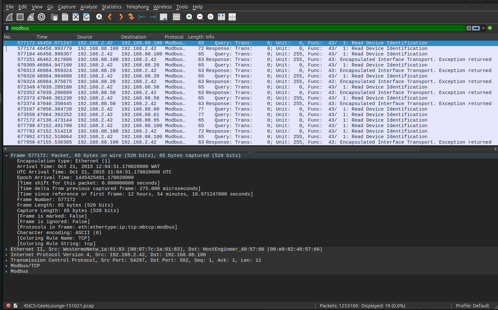
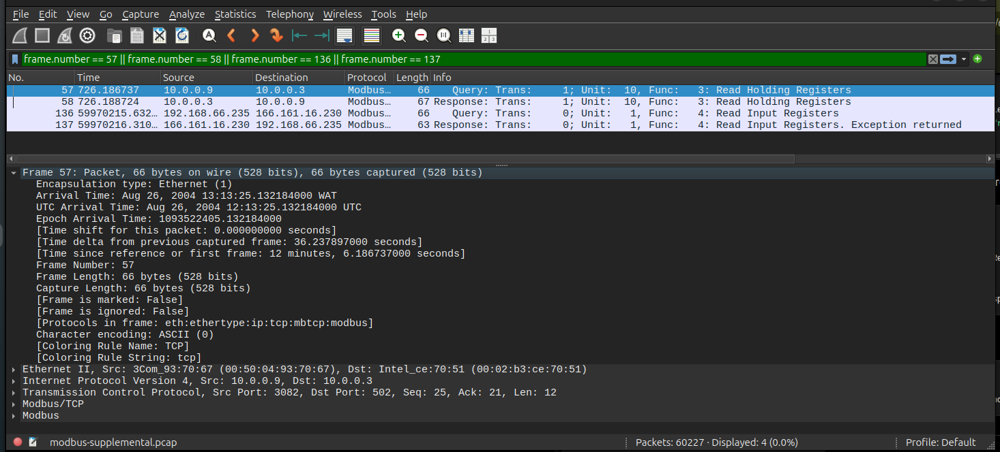
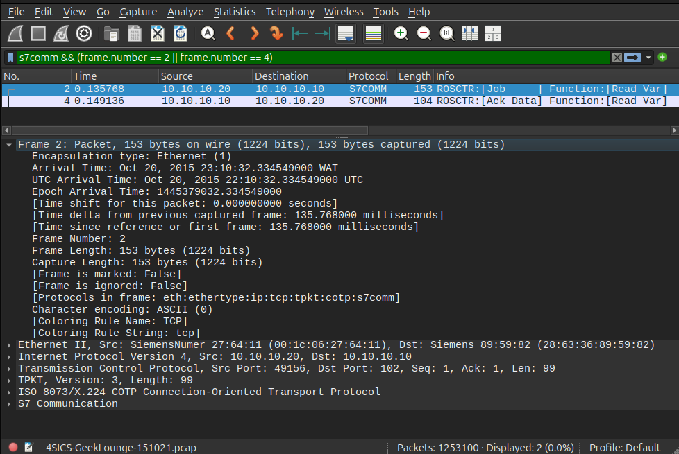
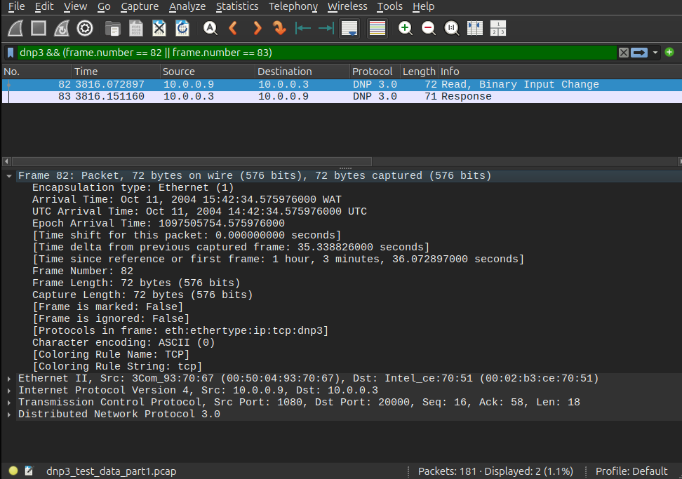
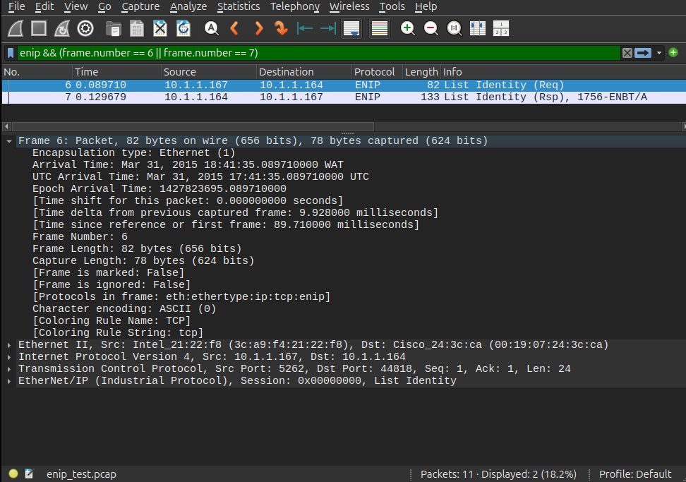

# ACICP301 Practical Lab 07 — Exploring ICS Packet Captures

## Objective

This lab used passive packet analysis to examine HTTP, FTP, Modbus/TCP, DNP3, EtherNet/IP and Siemens S7 communications.

No scanning, exploitation, credential reuse or interaction with captured systems was performed.

## Analysis Environment

- Tools: Wireshark and TShark
- Primary capture: `4SICS-GeekLounge-151021.pcap`
- Size: 139,998,821 bytes
- Packets: 1,253,100
- Duration: approximately 24 hours
- SHA-256: `7365b0ea475b76bf79b207fd8f83baa45e4449aead5da6a9214bbcffbc5fa7de`

## Dataset Scope

The primary 4SICS capture provided confirmed:

- HTTP
- FTP
- Modbus/TCP
- S7comm

DNP3 and EtherNet/IP were not confirmed as decoded application traffic in the primary capture. Public ICS training captures were therefore used as supplemental study material for those protocol families.

A supplemental Modbus capture was also used because the primary dataset contained only Function Code 43.

### Supplemental Captures

| Purpose | File | SHA-256 |
|---|---|---|
| DNP3 | `dnp3_test_data_part1.pcap` | `71779cac342a37b412df5bb6372ec22c35b5127ad2bfed4447d7ab6b92ebb4bf` |
| EtherNet/IP | `enip_test.pcap` | `0ba6c01fde28912e9f890d839b991cff71cca8e8259e1d93e9c3a312c43bc255` |
| Additional Modbus functions | `modbus-supplemental.pcap` | `bb37b8992e8cefec6a6b4438656bb0f6dd6477e1a668905045a4cbe9d56ddc93` |

The supplemental captures are clearly identified and are not represented as traffic from the primary 4SICS dataset.

---

## Evidence 01 — HTTP Basic Authentication

Filter:

`http.authbasic`

Representative frame:

- Frame 571931
- Source: 192.168.2.42
- Destination: 192.168.88.25
- Protocol: HTTP
- Operation: GET request

Wireshark identified HTTP Basic Authentication material. Credential values were intentionally excluded from the submitted screenshot.

---

## Evidence 02 — FTP Device Banner

Filter:

`ftp`

Representative frame:

- Frame 480883
- Source: 192.168.88.49
- Destination: 192.168.2.64
- Protocol: FTP
- Banner: AXIS 206 Network Camera 4.40

FTP USER and PASS commands were also present, but credential arguments were not included in submitted evidence.

---

## Evidence 03 — Modbus/TCP Device Identification

Filter:

`modbus`

Representative exchange:

- Frame 577172: Query
- Frame 577174: Response
- Source: 192.168.2.42
- Destination: 192.168.88.100
- Function Code 43: Read Device Identification

### Additional Modbus Function Codes

The supplemental Modbus capture demonstrated:

| Code | Function |
|---:|---|
| 01 | Read Coils |
| 03 | Read Holding Registers |
| 04 | Read Input Registers |
| 05 | Write Single Coil |
| 06 | Write Single Register |
| 08 | Diagnostics |
| 17 | Report Slave ID |
| 43 | Read Device Identification |

The submitted screenshot specifically demonstrates Function Codes 03 and 04.

---

## Evidence 04 — Siemens S7

Filter:

`s7comm`

Representative exchange:

- Frame 2: 10.10.10.20 → 10.10.10.10 — Job, Read Var
- Frame 4: 10.10.10.10 → 10.10.10.20 — Ack_Data, Read Var

---

## Evidence 05 — DNP3

Filter:

`dnp3`

Supplemental capture:

- Frame 82: 10.0.0.9 → 10.0.0.3 — Read, Binary Input Change
- Frame 83: 10.0.0.3 → 10.0.0.9 — Response

---

## Evidence 06 — EtherNet/IP

Filter:

`enip`

Supplemental capture:

- Frame 6: 10.1.1.167 → 10.1.1.164 — List Identity Request
- Frame 7: 10.1.1.164 → 10.1.1.167 — List Identity Response
- Device information: 1756-ENBT/A

---

# Protocol Evidence Matrix

| Protocol | Filter | Endpoints | Observed Operation | Security Significance |
|---|---|---|---|---|
| HTTP | `http.authbasic` | 192.168.2.42 → 192.168.88.25 | Basic-authenticated GET | Basic Authentication uses reversible Base64 encoding; unprotected HTTP can expose authentication material. |
| FTP | `ftp` | 192.168.2.64 ↔ 192.168.88.49 / 192.168.88.25 | Banner and USER/PASS operations | FTP lacks native confidentiality and can expose credentials and device metadata. |
| Modbus/TCP | `modbus` | 192.168.2.42 ↔ 192.168.88.100 | Read Device Identification | Visible Modbus traffic can expose device identity and operational information. |
| DNP3 | `dnp3` | 10.0.0.9 ↔ 10.0.0.3 | Read Binary Input Change / Response | Passive analysis can reveal telemetry and control-system relationships. |
| EtherNet/IP | `enip` | 10.1.1.167 ↔ 10.1.1.164 | List Identity Request / Response | Identity exchanges may reveal industrial product and asset information. |
| S7comm | `s7comm` | 10.10.10.20 ↔ 10.10.10.10 | Read Var / Ack_Data | Variable reads reveal PLC communication relationships and process-access patterns. |

---

# Security Assessment

The packet captures demonstrate several security concerns relevant to industrial-control environments.

First, HTTP Basic Authentication was visible in the primary capture. Base64 provides encoding rather than encryption, so authentication material can be recovered when HTTP traffic is not protected by TLS. Credential values were deliberately excluded from submitted evidence.

Second, FTP exposed cleartext protocol operations and device banners. The capture revealed an AXIS 206 Network Camera and software information. Such metadata can support legitimate asset inventory but may also assist unauthorized reconnaissance.

Third, Modbus/TCP exposed device-identification traffic. Function Code 43 appeared in the primary dataset, while supplemental traffic demonstrated Read Holding Registers and Read Input Registers. This shows how industrial communications can reveal device functions and operational activity.

Fourth, S7comm traffic repeatedly contained Read Var operations between 10.10.10.20 and 10.10.10.10. Passive observation therefore revealed PLC communication relationships without interacting with the systems.

Fifth, supplemental DNP3 traffic showed reads, responses and unsolicited messaging. Such traffic can reveal telemetry relationships and process-system roles.

Sixth, the EtherNet/IP supplemental capture contained a List Identity response identifying a 1756-ENBT/A device. Device identity information is valuable for asset management but may also expose useful reconnaissance information.

The primary capture also showed systems contacting multiple hosts and services using different protocol probes. This is consistent with service or version discovery, although the capture alone does not establish malicious intent.

Risk-reduction measures include network segmentation, industrial firewalls, access-control lists, monitoring and anomaly detection, restricted management paths, strong authentication, secure gateways or encrypted transport where supported, and removal of unnecessary services.

---

# Knowledge Check

## 1. Why does Base64 encoding not provide confidentiality for HTTP Basic authentication?

Base64 is an encoding mechanism rather than encryption. Anyone who obtains the encoded value can reverse it. Basic Authentication therefore requires a protected transport such as TLS for confidentiality.

## 2. What information can device banners or protocol metadata reveal?

They can reveal vendor, product type, model, software or firmware version, available services, network role and protocol capabilities.

## 3. How do Modbus, DNP3, EtherNet/IP and S7 differ from HTTP or FTP?

Modbus, DNP3, EtherNet/IP and S7 are primarily industrial-control protocols used for automation, telemetry, PLC communication and process control. HTTP and FTP are general-purpose application protocols commonly used for web access and file transfer.

## 4. Why is passive packet analysis valuable in an ICS environment?

Passive analysis identifies systems, protocols, communication relationships and operational patterns without transmitting traffic to industrial devices. This reduces the risk of disturbing sensitive control equipment.

## 5. What compensating controls can reduce risk where legacy industrial protocols cannot be replaced immediately?

Controls include segmentation, industrial firewalls, ACLs, allowlisting, secure remote-access gateways, intrusion detection, restricted administrative access, strong authentication on surrounding systems, encrypted tunnels where appropriate, and continuous traffic monitoring.

---

# Conclusion

Lab 07 demonstrated how passive packet analysis can reveal significant information about conventional IT and industrial-control communications.

The primary 4SICS capture provided confirmed HTTP, FTP, Modbus/TCP and S7comm evidence. Supplemental public ICS training captures were transparently used for DNP3, EtherNet/IP and additional Modbus function-code analysis where the primary capture did not contain the required decoded traffic.

No discovered credentials were reused, and credential values were excluded from submitted evidence.
